# TDT 4120 - Algoritmer og datastrukturer

<meta name="author" content="Hoyby">

-   Repo: https://github.com/Hoyby/NTNU-TDT4120-AlgDat

-   PDF download: https://github.com/Hoyby/NTNU-TDT4120-AlgDat/README.pdf

## Teori

1. [_Problem og algoritmer_](#of1)
2. [_Datastrukturer_](#of2)
3. [_Splitt og hersk_](#of3)
4. [_Rangering i lineær tid_](#of4)
5. [_Rotfaste trestrukturer_](#of5)
6. [_Dynamisk programmering_](#of6)
7. [_Grådige algoritmer_](#of7)
8. [_Traversering av grafer_](#of8)
9. [_Minimale spenntrær_](#of9)
10. [_Korteste vei fra én til alle_](#of10)
11. [_Korteste vei fra alle til alle_](#of11)
12. [_Maksimal flyt_](#of12)
13. [_NP-kompletthet_](#of13)
14. [_NP-komplette problemer_](#of14)

-   [Her](https://github.com/Hoyby/NTNU-TDT4120-AlgDat/Algoritmer%20i%20pensum) ligger de fleste av algoritmene som er
    pensum skrevet i _Python_

-   [Her](https://github.com/Hoyby/NTNU-TDT4120-AlgDat/Algorithms.md) ligger kjøretiden på de fleste av algoritmene
    nevnt i dette dokumentet.

## Liste over øvinger:

-   [x] [Øving 1](https://github.com/Hoyby/NTNU-TDT4120-AlgDat/Assignment_1)
-   [x] [Øving 2](https://github.com/Hoyby/NTNU-TDT4120-AlgDat/Assignment_2)
-   [x] [Øving 3](https://github.com/Hoyby/NTNU-TDT4120-AlgDat/Assignment_3)
-   [x] [Øving 4](https://github.com/Hoyby/NTNU-TDT4120-AlgDat/Assignment_4)
-   [x] [Øving 5](https://github.com/Hoyby/NTNU-TDT4120-AlgDat/Assignment_5)
-   [x] [Øving 6](https://github.com/Hoyby/NTNU-TDT4120-AlgDat/Assignment_6)
-   [x] [Øving 7](https://github.com/Hoyby/NTNU-TDT4120-AlgDat/Assignment_7)
-   [x] [Øving 8](https://github.com/Hoyby/NTNU-TDT4120-AlgDat/Assignment_8)
-   [x] [Øving 9](https://github.com/Hoyby/NTNU-TDT4120-AlgDat/Assignment_9)

</br></br>

## Andre gode kilder:

-   https://www.wikipendium.no/TDT4120_Algoritmer_og_datastrukturer/nb/
-   https://www.programiz.com/dsa
-   https://github.com/henrhoi/Algdat-TDT4120
-   https://kjaer.io/algorithms/#why-always-n-log-n

</br></br></br>

## Problem og algoritmer <a name="of1"></a>

|                   Asymptotic Complexity Chart                    |                          Asymptotic Notation                          |
| :--------------------------------------------------------------: | :-------------------------------------------------------------------: |
| 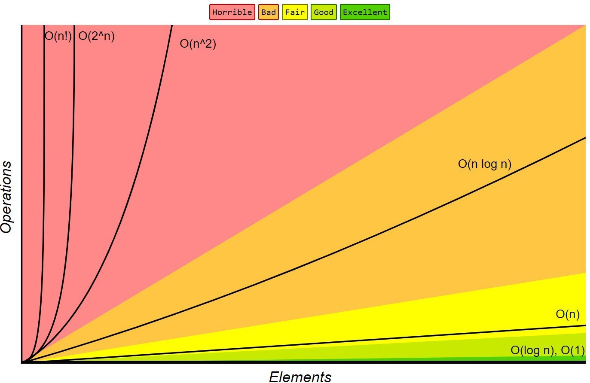 |  |

**O**: Øvre grense &nbsp; **Ω**: Nedre grense &nbsp; **Θ**: Øvre og nedre grense &nbsp;

**Kjøretid**:

-   Best-case:
-   Worst-case:
-   Average-case:

### Amortisert analyse:

I en amortisert analyse, regner vi ut den gjennomsnittlige tiden for å utføre en sekvens av operasjoner over alle
operasjonene som ble utført. Amortisert analyse vurderer både kostbare og rimeligere operasjoner sammen over hele serien
av operasjoner av algoritmen og viser at gjennomsnittskostnaden for en operasjon kan være liten, selv om en enkelt
operasjon i sekvensen kan være dyr. Amortisert analyse skiller seg fra gjennomsnittsanalyse ved at sannsynligheten ikke
er involvert – En amortisert analyse garanterer gjennomsnittlig ytelse for hver operasjon i verste tilfelle.

#### Eksempel:

Vi vil definere en _load-factor_ α til en ikke-tomt array _T_ til å være `α = elements/A.length`

-   **Tabell-ekspansjon**:
    -   Et array er full når enten alle plassene i arrayet er i bruk eller når _load-factoren_ α = 1.
    -   Dersom vi skal innsette et element i et fullt array, må vi ekspandere arrayet, ved å lage et nytt array med fler
        plasser enn den gamle og kopiere over alle de gamle elementene.
    -   Så en gang i blant dersom α = 1 vil innsetting av et element bruke mye lenger tid enn _O(1)_, og dette tar vi
        med i beregningen med **amortisert analyse**.

```sudocode
TABLE-INSERT(T,x):
1 	 if T.size == 0:
2		 allocate T.table with 1 slot
3		 T.size = 1
4
5	 if T.num == T.size:
6		 allocate new-table with 2 * T.size slots
7		 insert all items in T.table into new-table
8		 free T.table
9		 T.table = new-table
10		 T.size = 2 * T.size
11
12	 insert x into T.table
13	 T.num = T.num + 1
```

**Dynamisk array**: Tabell som automatisk blir utvidet dersom alle plassene er tatt eller _load-factor_ α = 1.

</br></br></br>

## Datastrukturer <a name="of2"></a>

<a name="ov1"></a>

### Lenket liste

-   _Enkle_ lenkede lister


-   _Doble_ lenkede lister


-   _Sykliske_ lenkede lister


  
**Kjøretider** *(antar enkel lenket liste)*:

    *  Innsetting i starten: *O(1)*
    *  Innsetting i slutten: *O(n)*
    *  Oppslag: *O(n)*
    *  Slette element: *Oppslagstid* + *O(1)* = *O(n)*

> Ved dobbel lenke liste blir det lett med innsetting, trenger kun å endre _.prev_ og _.next_ til de nye naboene. Dette
> gjøres i O(1)

</br>

### Queue

_FIFO-struktur_ (First in First Out)


```python
class Queue:
    def __init__(self):
        self.items = []

    def isEmpty(self):
        return self.items == []

    def enqueue(self, item):
        self.items.insert(0,item)

    def dequeue(self):
        return self.items.pop()

```

> Operasjonene bruker _O(1)_ tid

> En [_prioritetskø_](#prioritetskø) fjerner elementene i køen som har høyest prioritet fremfor å følge den vanlige
> FIFO-strukturen.

</br>

### Stack

_LIFO-struktur_ (Last in First Out)


```python
class Stack:
     def __init__(self):
         self.items = []

     def isEmpty(self):
         return self.items == []

     def push(self, item):
         self.items.append(item)

     def pop(self):
         return self.items.pop()

```

> Operasjonene bruker _O(1)_ tid

</br>

### Hash-tabeller

En fornuftig måte å adressere og komprimere.

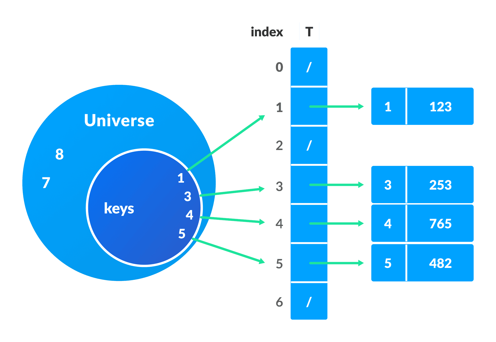

Bruker hash-funksjoner og nøkler slik at et element _e_ med nøkkel _k_ blir lagret på plass h( _k_ ).

-   Vi kan løse kollisjon-problemet ved chaining med lenkede lister.
-   Idéen med hash-tabeller er å lage _h_ slik at den virker ”random” for å forhindre kollisjon eller i det minste;
    minske antallet.
-   Ved hash-tabell med lenket liste har vi metodene:

    -   Chained-Hash-Insert (T, x) `- insert x at the head of list T[h(x.key)`

    -   Chained-Hash-Search (T, k) `- search for an element with key k in list T[h(k)]`

    -   Chained-Hash-Delete (T, x) ` - delete x from list T[h(x.key)]`</p>

-   WC for insertion er O(1)
-   WC for søk er O(n), ønsker å ha O(1), så kan være dårlig hashemetode som forårsaker dårlig søketid.
-   Vi kan slette et element med O(1) dersom hash-tabellen bruker _doble_ lenkede lister.
-   _Hva karakteriserer en god hashefunksjon:_ Den unngår kollisjoner, og like sannsynlig for hver mulige nøkkel å bli
    plassert et sted.

</br></br></br>

## Splitt og hersk <a name="of3"></a>

**Designmetoden i splitt og hersk:**

-   **Splitt** problemet inn i subproblemer som er mindre instanser av det samme problemet.
-   **Hersk** subproblemene ved å løse dem rekursivt. Hvis et subproblems størrelse er lite nok, løs problemet direkte.
-   **Kombiner** løsningene på subproblemene inn i løsningen på problemet i utgangspunktet

Vi deler opp problemet helt til vi kommer til minste mulige instans av problemet, så sier vi at rekursjonen har ”bottoms
out” og vi har kommet til base case. Vi får resultatet når vi kombinerer løsningene.

</br>

### Binærsøk:

**Input**: En sortert liste A, pivot-element _p_, slutt-element _r_ og elementet _v_ som vi søker etter

**Output**: Indeks _i_ slik at `A[i] = v`

_Rekursiv løsning:_

```python
def Recursive_binary_search(A, p, r, v):
    i = p
    if p < r:
        mid = (p+r)//2
        if v <= A[mid]:
            i = Recursive_binary_search(A,p,mid,v)

        else:
            i = Recursive_binary_search(A,mid+1,r,v)
    return i


```

_Iterativ løsning:_

```python
def Iterative_binary_search(A, p, r, v):
    while p < r:
        mid = (p+r)//2

        if v <= A[mid]:
            r = mid

        else:
            p = mid + 1

    return p

```

> Dersom det finnes flere forekomster av _v_ i A vil Bisect returnere indeksen til forekomsten lengst til venstre, altså
> den **laveste** indeksen

**Kjøretid**:

-   Θ(_lg n_)

</br>

### Merge sort

-   Sammenligningsbasert
-   Stabil
-   Splitt og hersk rekursiv

1. **Splitt:** Del-opp steget regner kun ut midten av listen, som tar konstant tid. Da blir `D(n) = Θ(1)`.
2. **Hersk:** Vi løser rekursivt to delproblemer, hver på størrelse n/2, som bidrar med `2*T(n/2)` kjøretid på
   algoritmen.
3. **Kombiner:** Merge-prosedyren bruker Θ(n) tid på en n-element liste, så derfor blir `C(n) = Θ(n)`


Når vi adderer funksjonene D(n) og C(n) for merge-sort analysen, vil summen av (n) og (1), bli (n). Når vi summerer det
igjen sammen med 2T(n/2)-delen fra ”hersk”-seget gir rekurrensen for verste kjøretiden T(n) for merge-sort:

`T(n) = 2T(n/2) + Θ(n) if n > 1, else O(1)`

> Dersom vi bruker master-teoremet (**Kap. 4**) så kan vi vise at `T(n) = (n lg n)`.

```python
def merge_sort(A):
    if len(A)>1:
        q = len(A)//2
        lh = merge_sort(A[:q])
        rh = merge_sort(A[q:])
        return merge(lh,rh)

    return A


def merge(lh,rh):
    res = []
    i = 0
    j = 0

    while i<len(lh) and j<len(rh):
        if lh[i] < rh[j]:
            res.append(lh[i])
            i+=1

        else:
            res.append(rh[j])
            j+=1

    if i<len(lh): res.extend(lh[i:])
    if j<len(rh): res.extend(rh[j:])

    return res
```

</br>

### Quicksort

-   Sammenligningsbasert
-   Ikke Stabil
-   Splitt og hersk rekursiv

1. **Splitt:** Del opp listen `A[p..r]` i to sublister ved å benytte en pivot `q`-, slik at hvert element i `A[p..q-1]`
   er mindre eller lik pivoten, som igjen er mindre eller lik hvert element i `A[q+1..r]`.

2. **Hersk:** Sorter de to listene `A[p..q-1]` og `A[q+1..r]` igjen med rekursive kall til quicksort.

3. **Kombiner:** Fordi sublistene allerede er sortert, trengs det ikke å gjøres noe for å kombinere dem: hele listen
   `A[p..r] er nå sortert. <a name="Partition"></a>


```python
def Quicksort(A, p, r):
    if p < r:
        q = Partition(A, p, r)
        Quicksort(A, p, q-1)
        Quicksort(A, q+1, r)


def Partition(A, p, r):
	# Partition jobber slik
	# ≤x | ≥x | x

    x = A[r]
    i = p-1
    for j in range(p, r):
        if A[j] <= x:
            i += 1
            A[i], A[j] = A[j], A[i]

    A[i+1], A[r] = A[r], A[i+1]
    # Listen blir slik slik:
    # ≤x | x | ≥x
    return i+1
```

> _Quicksort_ er **ikke stabil**, da den ikke beholder den relative rekkefølgen til like elementer under sorteringen av
> listen.

**Partition:**

Listeelementet `A[r]` blir pivot-elementet _x_. Listen itererer fra venstre til høyre og sammenlikner veriden med
pivoten. Er den høyere blir den swappet med det første elementet i listen, dette gjør den for alle elementer i listen,
og resulterer i en liste som ser slik ut: ≤x | x | ≥x

> De to siste linjene i Partition avslutter prosedyren ved å bytte pivot elementet A[r] med A[i+1]

**Kjøretid:**

-   _Worst-case:_ Θ(_n<sup>2</sup>_)
-   _Forventet kjøretid:_
    -   Rekursjonstre med dybde Θ(_lg n_) med O(_n_) arbeid på hvert nivå
    -   `T(n) = 2T(n/2) + Θ(n) = Θ(n lg n)`

</br>

#### Randomized-Quicksort

Samme algoritme som _quicksort_, bortsett fra at pivot-elementet byttes ut med et tilfeldig element fra listen. Vil gi
færre tilfeller av worst-case-kjøretid.

```python
def Quicksort(A, p, r):
    if p < r:
        q = Randomized_Partition(A, p, r)
        Quicksort(A, p, q-1)
        Quicksort(A, q+1, r)


def Randomized_Partition(A, p, r):
    i = random.randint(p,r)
    A[i], A[r] = A[r], A[i]

    return Partition(A,p,r)


def Partition(A, p, r):
    x = A[r]
    i = p-1
    for j in range(p, r):
        if A[j] <= x:
            i += 1
            A[i], A[j] = A[j], A[i]

    A[i+1], A[r] = A[r], A[i+1]
    return i+1
```

</br></br></br>

## Rangering i lineær tid <a name="of4"></a>

### Sammenligningsbasert sortering:

_Disse algoritmene benytter seg kun av sammenlikning av input-elementene. Slike sorteringsalgoritmer har følgende
kompleksiteter:_

| Worst                 | Average               | Best            |
| :-------------------- | :-------------------- | :-------------- |
| $T_W(n) = O(∞)$       | $T_A(n) = O(∞)$       | $T_B(n) = O(∞)$ |
| $T_W(n) = Θ(?)$       | $T_A(n) = Θ(?)$       | $T_B(n) = Θ(?)$ |
| $T_W(n) = Ω(n lg(n))$ | $T_A(n) = Ω(n lg(n))$ | $T_B(n) = Ω(n)$ |

> Enhver sammenligningsbasert sorteringsalgoritme krever (n lg n) sammenlikninger i worst case.

</br>

### Counting Sort

-   Ikke sammenligningsbasert
-   Stabil

Counting sort antar at hvert av de n elementene er et tall mellom 0 og _k_. Når _k_ er _O(n)_, sorterer algoritmen på
Θ(_n_).

Algoritmen teller antall forekomster av verdiene og legger den kumulative summen på indexene til den nye listen,
`count[0..k]`.


```python
def counting_sort(A,k):
   res = [0]*len(A)
   count = [0 for _ in range(k+1)]

   for j in range(0,len(A)):
       count[A[j]] += 1

   # C[i] inneholder nå antall forekomster av element i

   for i in range(1,k+1):
       count[i] += count[i-1]
   # Count er nå kumulativ sum
   # C[i] inneholder nå antall elementer mindre eller lik i

   # Itererer baklengs gjennom A, for at Counting blir stabil. Trekker fra en på count når vi plasserer et element
   for j in range(len(A)-1,-1,-1):
       element = A[j]

       res[count[element]-1] = element
       count[element] -= 1

   return res

```

</br>
 
### Radix sort
*Radix sort *er algoritmen som brukes i kort-sortering maskiner. Radix sort løser problemet ved å sortere på det *least significant digit* først.

```sudocode
RADIX-SORT(A, d)
 	for i = 1 to d
 		use a stable sort to sort array A on digit i

```

**Input:** En liste _A_ med _n_ elementer bestående av _d_ siffer

**Output:** Sortert liste bestående av elementene i _A_


```python
def radix_sort(A, d):
    for i in range(d-1,-1,-1):
        # Bruker vlagfri stabil sorterings algoritme
        A = counting_sort(A,9,i)

    return A


# Sorterer større tall ved å kun se på et siffer.
# k = støste tall (9), i = sifferindeks

def counting_sort(A,k,d):
    res = [0]*len(A)
    count = [0 for _ in range(k+1)]

    for j in range(0,len(A)):
        element = int(str(A[j])[d])
        count[element] += 1

    # C[i] inneholder nå antall forekomster av element i

    for i in range(1,k+1):
        count[i] += count[i-1]
    # Count er nå kumulativ sum
    # C[i] inneholder nå antall elementer mindre eller lik i

    # Itererer baklengs gjennom A, for at Counting blir stabil. Trekker fra en på count når vi plasserer et element
    for j in range(len(A)-1,-1,-1):
        element = A[j]

		 #Plasserer hele elementet i listen selvom jeg sorterer på hensyn på ett siffer
        res[count[int(str(element)[d])]-1] = element
        count[int(str(element)[d])] -= 1

    return res
```

Gitt _n_ _d_-siffrede tall kan hvert siffer være en av _k_ mulige verdier, vil Radix sort sortere disse tallene i
`Θ(d (n + k))` tid, hvis den stabile sorteringsalgoritmen bruker `Θ(n + k)` tid.

_Viktig_ at sorteringsalgoritmen vi velger er **stabil** fordi at elementene med likt tall på siffer _d_ ikke mister sin
relative rekkefølge og ødelegger for sorteringen på de tidligere sorteringskallene.

</br>

### Bucket sort

Bucket sort antar at instansen er tatt fra en uniform fordeling og har en average-case kjøretid på `O(n)`, og worst-case
`O(n^2)`.

Som _Counting sort_ er Bucket sort rask fordi den gjør antagelser på instansen. Bucket sort deler opp intervallet
`[0, 1)` inn i n like store intervaller, eller **buckets**.

```python
def bucket_sort(A):
    n = len(A)
    B = [[] for _ in range(n)]

    for i in range(n):
        B[int(n*A[i])].insert(-1, A[i])

    for j in range(n):
        insertion_sort(B[j])

    res = []
    for i in range(len(B)):
        res += (B[i])

    return res

```

> Tallet `int(n*A[ i ])` gir hvilken bucket som elementet skal legges i, `n*A[ i ]` rundes ned og blir en verdi i
> intervallet `[0, 1)` som har _n_ buckets


**Kjøretid:**

-   Average-case: _O(n)_
-   Worst-case: _O(n<sup>2</sup>)_

</br>

### Minimum og maksimum

```python
MINIMUM(A):
1	 min = A[0]
2	 for i in range(1,len(A))
3		 if min > A[i]:
4			 min = A[i]
5	 return min
```

> Finner maksimum ved å ende `min > A[i]` til `min ≤ A[i]`

</br>

### Randomized-Select

_Randomized-Select_ jobber kun på **én** side av partisjoneringen, og har derfor forventet kjøretid på `O(n)`, og
worst-case `O(n^2)`. Algoritmen skal returnere det _i_’te minste elementet i listen `A[p .. r]`. Bruker litt samme
fremgangsmåte som quicksort, men pivot er alltid på siden av tallet vi skal finne. Når sorteringen har kommet frem til
indexen vi leter etter vet vi verdien.

**Input:** En liste _A_ med pivot-element _p_, sluttelement _r_ og ønske om å finne _i_ ´te minste element i _A_

**Output:** Indeks i A til _i_ ´te minste element

```python
RANDOMIZED-SELECT(A,p,r,i):
def randomized_select(A,p,r,i):
    if p == r:
        return A[p]
    q = randomized_partition(A,p,r)

    # k er antall tall til venstre for q, dvs. at det finnes nøyaktig k tall mindre enn A[q]
    k = q - p + 1
    if k == i:
        return A[q]
    elif i < k:
        return randomized_select(A,p,q-1,i)
    else:
        return randomized_select(A,q+1,r,i-k)
```

-   Trykk for [video](https://www.youtube.com/watch?v=AHaaFVmAsvA) for bedre forklaring!

**Kjøretid:**

-   Expected-case: _Θ(n)_
-   Worst-case: _Θ(n <sup>2</sup>)_

</br>

### Select

Som _Randomized-Select_, finner _Select_ et ønsket element gjennom rekursiv partisjonering av input. I motsetning til
Randomized-Select, kan vi _garantere_ en god split under partisjoneringen. _Select_ bruker den deterministiske part.
algoritmen [_Partition_](#Partition), med modifisert til å ta inn hvilket element som partisjoneringen skal skje rundt.

_Select_-algortimen returnerer det _i_ 'te minste elementet i input med n > 1 distinkte elementer ved å gjennomføre
følgende steg. Dersom n = 1, returnerer den bare input.

1. Del opp de _n_ elementene i input til &lfloor; <sup>_n_</sup>&frasl;<sub>5</sub> &rfloor; grupper med 5 elementer
   hver, og på det meste en gruppe bestående av de gjenstående _n_ mod 5 elementene.

2. Finn medianen til hver av de &lceil; <sup>_n_</sup>&frasl;<sub>5</sub> &rceil; gruppene ved å sortere elementene
   (≤ 5) med [Insertion-sort](#insertionsort), og velg deretter median.
3. Bruk _Select_ rekursivt for å finne medianen _x_ av de &lceil; <sup>_n_</sup>&frasl;<sub>5</sub> &rceil; medianene i
   steg 2. Hvis det er partalls medianer blir _x_ den mindre medianen.
4. Partisjoner input rundt median av medianer _x_ ved å bruke den modifirserte versjonen av _Partition_. La _k_ være en
   større en antall elementer på venstre side av partisjoneringen, slik at _x_ er det _k_ 'te minste elementet og det
   der _n_ - _k_ elementer på høyre side.
5. Dersom `i == k`, returner _x_. Hvi sikke bruk _Select_ rekursivt for å finne det _i_ 'te minste elementet på venstre
   side `if i < k` eller det (_i_ - _k_)'te minste elementet på høyre side `if i > k`.

```sudocode
SELECT(A,i)
	if A.length = 1
		return A[0]
	if A.length ≤ 5
	    INSERTION-SORT(A)
	    return A[i]
	Partition L into the subsets S[i] with five elements each
	    # There will be n/5 ± 1 subsets total.
	for i = 1 to n/5
	    x[i] = select(S[i],3)
	M = select({x[i]}, n/10)
	Partition A into L[..] < A[M] and R[..] > A[M]

	if k <= length(L)
	    return select(L,k)
	elif k > length(L)
	    return select(R,i-len(L))
	else return A[M]
```

-   _Select_ kodet i Python ligger
    [**her**](https://github.com/Hoyby/AlgDat-TDT4120/blob/master/Algoritmer%20i%20pensum/Line%C3%A6r%20rangering/Select.py)

</br></br></br>

## Rotfaste trestrukturer <a name="of5"></a>

Den **binære heap** datastrukturen er en liste som vi kan se på som et nesten komplett binærtre. Hver node i treet
korresponederer til et element til listen. Treet er helt fylt i alle nivående med unntak av mulig det laveste, som er
fylt fra venstre mot høyre.

Roten til treet er A[0] og gitt en index i til en node, kan vi lett finne indeksen til dets forgjenger, venstre barne
eller høyre barn

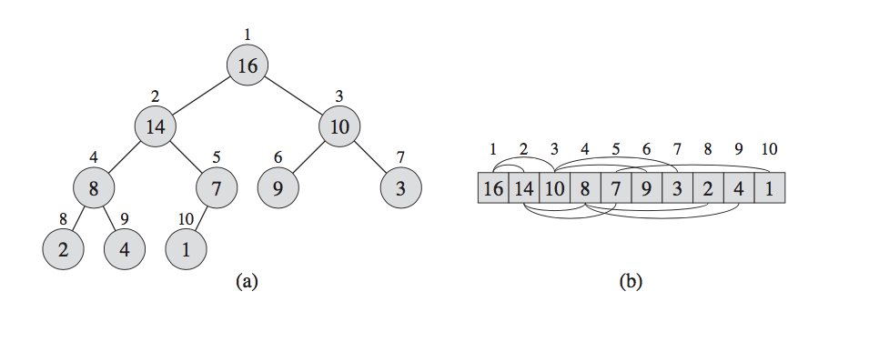

```python
def parent(i):
	return ⌊i/2⌋

def left(i):
	return 2*i

def right(i):
	return 2*i + 1
```

Det finnes to typer binære heaps. I begge typene tilfredsstiller verdiene i nodene en heap-egenskap, som avhenger av
typen heap:

-   **Max-heap egenskapen**:
    -   For hver node _i_ &ne; 0 er `A[parent(i)] ≥ A[i]`
    -   En nodes verdi er på det meste sin forgjengers verdi - dvs største element ligger i roten.
-   **Min-heaps egenskapen**:
    -   For hver node _i_ &ne; 0 er `A[parent(i)] ≤ A[i]`
    -   En nodes verdi er på det minste sin forgjengers verdi - dvs. minste element ligger i roten.

Dersom vi ser på en heap som et tree, definerer vi _høyden_ til en node i treet til å den lengste enkle veien fra noden
til en løvnode, og vi definer _høyden_ til treet til å være høyden til roten.

> Siden en heap av _n_ elementer er basert på et komplett binært tre, er dens høyde &theta;(lg _n_), so vi ser igjen på
> tradisjonelle heap-prosedyrer.

</br>

### Max-Heapify

For å bygge en heap med _max-heap egenskapen_, kaller vi på prosedyren _Max-Heapify_. Når den kalles antar algoritmen at
binærtreet med røtter i `left(i)` og `right(i)`, er max*heaps, men at A[*i* ] kanskje er mindre enn sine barn, som
bryter med heap-egenskapen. \_Max-Heapify* lar verdien til A[*i* ] "_flyte ned_" i max-heapen slik at subtreet med rot
på index _i_ holder heap-egenskapen.

**Problem:** Gjøre at input holder _heap-egenskapen_

```sudocode
MAX-HEAPIFY(A, i)
1	l = left(i)
2	r = right(i)
3	if l ≤ A.heap-size and A[l] >A[i]
4		largest = l
5	else largest = i
6	if r ≤ A.heap-size and A[r] > A[largest]
7		largest = r
8	if largest ≠ i
9		exchange A[i] with A[largest]
10		MAX-HEAPIFY(A,largest)
```

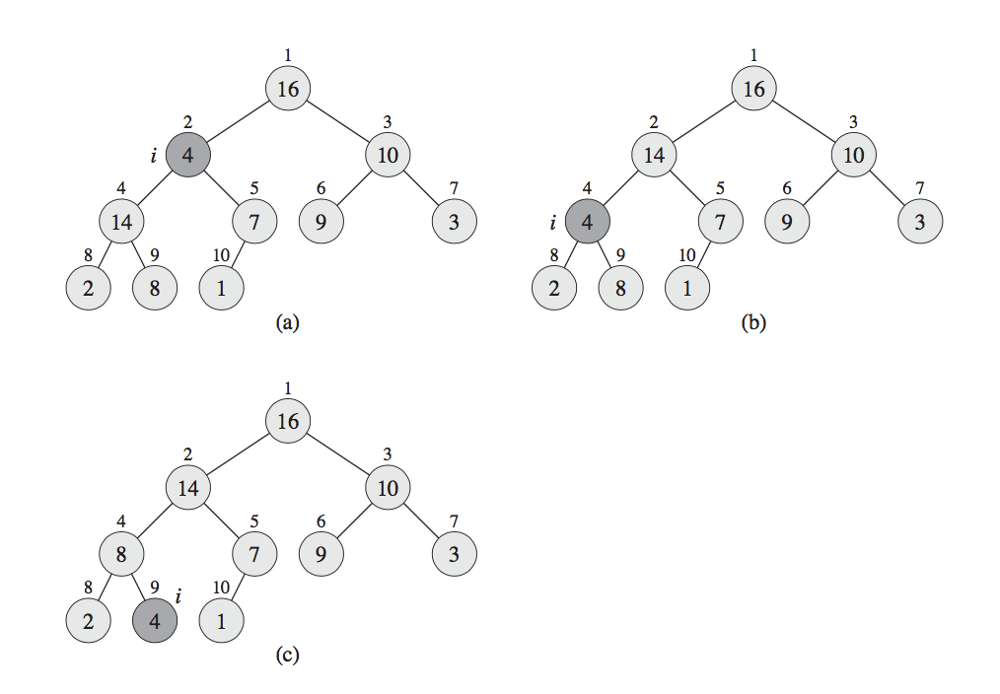

Kjøring av _Max-Heapify_ :

-   På hvert steg velges det største elementet av A[i], A[left(i)] og A[right(i)], og dets indeks blir lagret som
    _largest_. Dersom A[*i* ] er størst vil subtreet på node _i_ allerede være en max-heap og prosedyren terminerer.
-   Hvis ikke er en av de to barna det største elementet, og bytter vi plass på A[*i* ] og A[*largest* ], som gjør at
    node _i_ og dets barn tilfredstiller max-heap egenskapen.
-   Noden med indeks _largest_ har nå den orginale verdien til A[*i* ], og derfor kan det hende at subtreet med rot
    _largest_ muligens bryter med max-heap egenskapen. Derfor kaller vi _Max-Heapify_ rekursivt på subtreet.

**Kjøretid:**

-   `T(n) ≤ T(2n/3) + θ(1)`, som med _master teoremet_ gir `T(n) = O(lg n)`
-   Alternativt kan vi karakterisere kjøretiden på en node med høyde _h_ som `O(h)`

</br>

### Bygging av heaps

Vi kan bruke _Max-Heapify_ på en bottom-up måte for å convertere en liste A[0..n-1], hvor `n = A.length`, til en
max-heap. Elementene i listen `A[(⌊n/2⌋+1)..n]` er alle blader i treet, og alle er til å begynne med en 1-element heap.

Prosedyren _Build-Max-Heap_ går igjennom de **resterende** nodene av treet og kjører _Max-Heapify_ på hver node.

```sudocode
BUILD-MAX-HEAP(A)
1	A.heap-size = A.length
2	for i = ⌊A.heapsize/2⌋ downto 1
3		MAX-HEAPIFY(A, i)
```

Vi kan regne ut en øvre grense for kjøretiden til _Build-Max-Heap_ som følgende:

-   Hvert kall på _Max-Heapify_ koster `O(lg n)`, og _Build-Max-Heap_ gjør `O(n)` slike kall.
-   Derfor blir **kjøretiden** `O(n lg n)`, Det er en øvre grense, men ikke asymptotisk rett.

-   Vi kan sette en grense på **kjøretiden** til _Build-Max-Heap_ som `O(n)` da vi ser på høyden til nodene kaller
    _Max-Heapify_ på ikke gir O(lg n) på alle kallene.

</br>

### Heapsort

Heapsort-algoritmen starter med å bygge en max-heap av input `A[1..n]`. Siden det største elementet nå ligger som roten
_A[1]_, kan v putte den i sin endelige posisjon ved å bytte den med _A[n]_. Hvis vi nå ser bort fra node _n_ i heapen,
så kan vi enkelt deinkrementere A.heap-size.

```sudocode
HEAPSORT(A)
1	BUILD-MAX-HEAP(A)
2	for i = A.length - 1 downto 1
3		exchange A[0] with A[i]
4		A.heapsize -= 1
5		MAX-HEAPIFY(A,0)
```

**Kjøretid:**

-   **Heapsort** prosedyren bruker **`O(n lg n)`** tid siden kallet på _Build-Max-Heap_ tar O(_n_) tid og hvert av de
    _n - 1_ allee til _Max-Heapify_ tar O(lg _n_) tid.

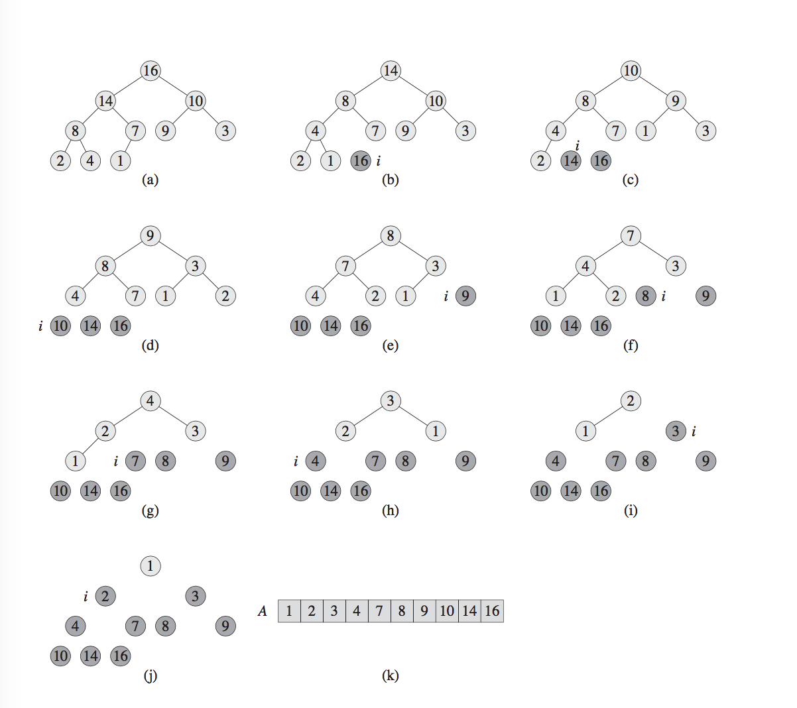

> Bruker mindre lagringsplass enn Merge-Sort

</br>

### Prioritetskø <a name="prioritetskø"></a>

Tar utgangspunkt i en max-heap for å implementere max-prioritetskøer. For å lage min-prioritetskøer er det bare å endre
litt på prosedyrene.

**Prioritetskø:** En prioritetskø er en datastruktur å opprettholde et sett S med elementer, hver assosiert med en verdi
kalt _key_. En _max-prioritetskø_ støtter følgende operasjoner

-   `INSERT(S, x)` setter inn et element _x_ inn i settet _S_ som er operasjonen `S = S ∪ {x}`
-   `MAXIMUM(S)` returnerer elementet i _S_ med størst _key_
-   `EXTRACT-MAX(S)` fjerner og returnerer elementet i _S_ med størst _key_
-   `INCREASE-KEY(S,x,k)` øker verdien tl elementet _x_ ´s _key_ til den nye verdien _k_, som antas å være større enn
    _x_ 's nåværende _nøkkelverdi_

> Alternativt støtter en min-prioritetskø operasjonene: `INSERT(S, x)`, `MINIMUM(S)`, `EXTRACT-MIN(S)` og
> `DECREASE-KEY(S,x,k)`.

```sudocode
HEAP-MAXIMUM(A)
1	return A[0]
```

-   _Kjøretid:_ **`θ(1)`**

```sudocode
HEAP-EXTRACT-MAX(A)
1	if A.heap-size < 1
2		error "heap underflow"
3	max = A[0]
4	A[0] = A[A.heapsize]
5	A.heapsize -= 1
6	MAX-HEAPIFY(A,0)
7	return max
```

-   _Kjøretid:_ **`O*(lg n)`** siden den gjør konstant arbeid på toppen av _O_(lg _n_) tiden for _Max-Heapify_

```sudocode
HEAP-INCREASE-KEY(A,i,key)
1	if key < A[i]
2		error "new key is smaller than current key"
3	A[i] = key
4	while i > 1 and A[PARENT(i)] < A[i]
5		exchange A[i] with A[PARENT(i)]
6		i = PARENT(i)
```

-   _Kjøretid:_ **`O(lg n)`** siden veien fra noden oppdatert i linje 3 til roten har lengde _O_(lg _n_).

```sudocode
MAX-HEAP-INSERT(A, key)
1	A.heap-size += 1
2	A[A.heap-size] = -∞
3	HEAP-INCREASE-KEY(A, A.heap-size, key)
```

-   _Kjøretid:_ **`O(lg n)`** siden den kun gjør O(1) arbeid over _Heap-Increase-Key_.

**Oppsummering:** En heap støtter enhver prioritetskø-operasjon på et sett av størrelse _n_ på **`O(lg n)`** tid!

</br>

### Rotfestede trær

**Problem:** Hvordan represetere rotfestede trær ved hjelp av lenket datastruktur.

**Binære trær:** Figuren under viser hvordan vi kan bruke attributtene _p_, _left_ og _right_ til å lagre pekere til
forelder, venstre barn og høyre barn til hver node i binærtreet T.

-   Dersom _x_._p_ = NIL, da er _x_ roten.
-   Dersom _x_ ikke har noen venstre barn, da er _x_._left_ = NIL, og likt for høyre barn.
-   Roten til treet T peker til å være attributten T._root_. Dersom T._root_ = NIL, da er treet tomt.

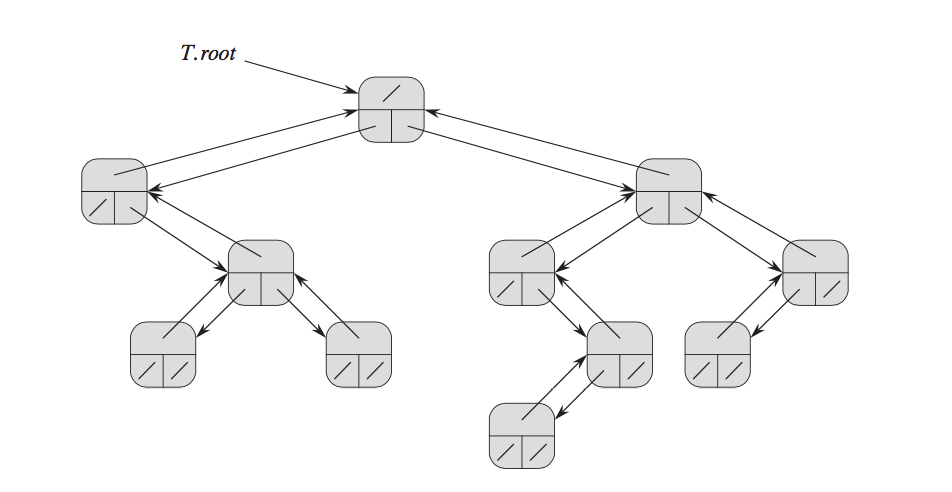

**Rotfestede trær med ubundet forgrening:** Vi kan utvide representasjonen av et binært tre til en klasse av trær der
antall barn til hver node er på det meste en konstant _k_ - vi bytter _left_ og _right_ attributtene til
_child<sub>1</sub>_, _child<sub>2</sub>_,.., _child<sub>k</sub>_.

Vi kan bruke _O(n)_ minne for en vilkårlig _n_ 'te rotfestet tre

-   For å finne oss frem i treet har hver node _x_ kun to pekere:
    -   _x_._left-child_ peker til det barnet mest til venstre for _x_
    -   _x_._right-sibling_ peker til den søskenen rett til høyre for _x_

</br>

### Binære søketrær

Denne søketre datastrukturen støtter mange dynamisk-sett operasjoner inkludert

<pre>
<b>Operasjoner</b>          <b>Kjøretid</b>
<i>Inorder-Tree-Walk</i>  Θ(n)
<i>Tree-Search</i>        O(h)
<i>Tree-Minimum</i>       O(h)
<i>Tree-Successor</i>     O(h)
<i>Tree-Insert</i>        O(h)
<i>Tree-Delete</i>        O(h)
</pre>

**Binært søketre:** Et binært søketre er organisert i et binærttre som vist under. Vi kan representere et slikt tre som
en lenket datastruktur der hver node er et objekt. I tilegg til en _key_ og et sett med data, har hver node attributtene
_left_, _right_, _p_ som peker til nodene korrespondere til sitt venstre barn, høyre barn og forelder, respektivt.
Dersom et barn eller forelder mangler er den gjeldende attributtens verdi NIL. Rotnoden er den eneste noden i treet som
har forelder lik NIL.

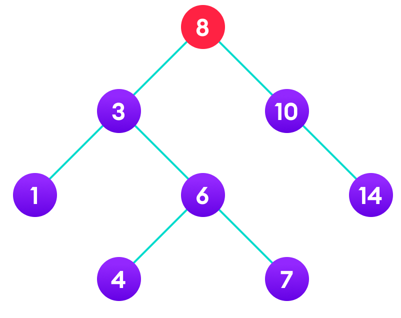

```python
class Node:
	def __init__(self, key):
		self.key = key
		self.p = None
		self.left = None
		self.right = None
```

-   _Binærsøketre-egenskapen_:
    -   La _x_ være en node i ett binært søketre:
        -   Hvis _y_ er en node i det venstre subtreet til _x_, da er `y.key ≤ x.key`.
        -   Hvis _y_ er en node i det høyre subtreet til _x_, da er `y.key ≥ x.key`.

**Inorder tree walk:** Simpel rekursiv algoritme som printer ut alle nøklene i treet i rekkefølge.

```sudocode
INORDER-TREE-WALK(x)
1	INORDER-TREE-WALK(x.left)
2	print x.key
3	INORDER-TREE-WALK(x.right)
```

> Det tar &theta;(_n_) tid å gå igjennom et _n_-node binært søketre.

**Søking:** Vi bruker følgende prosedyre for å søke etter en node med en gitt nøkkel i et binært søketre. Gitt en peker
til roten og en nøkkel _k_, returnerer _Tree-Search_ en peker til noden med key _k_, hvis den eksisterer, hvis ikke
returnerer den NIL.

```sudocode
TREE-SEARCH(x, k)
1	if x == NIL or k == x.key
2		return x
3	if k < x.key
4		return TREE-SEARCH(x.left, k)
5	else
6		return TREE-SEARCH(x.right, k)
```

**Kjøretid:** `O(h) = O(lg n)`

> Starter ved å søke ved roten, og traversere seg nedover, enten i venstre eller høyre subtre, til den finner den noden
> som den leter etter.

Vi kan også skrive om denne algoritmen til å være _iterativ_ ved å bytte ut rekursjonen til en **while**-løkke.

```sudocode
ITERATIVE-TREE-SEARCH(x, k)
1	while x ≠ NIL and k ≠ x.key
2		if k < x.key
3			x = x.left
4		else x = x.right
5	return x
```

> På de fleste PC-er er en iterativ versjon mer effektiv

**Minimum og maximum:**

-   _Binærsøketre-egenskapen_ garanterer oss at _Tree-Minimum_ og _Tree-Maximum_ er korrekte.

```sudocode
TREE-MINIMUM(x)
1	while x.left ≠ NIL
2		x = x.left
3	return x
```

> For å finne minimum traverserer man seg bare nedover mot venstre i treet til det ikke lenger går.

```sudocode
TREE-MAXIMUM(x)
1	while x.right ≠ NIL
2		x = x.right
3	return x
```

> For å finne maksimum traverserer man seg bare nedover mot høyre i treet til det ikke lenger går.

**Kjøretid:** Begge prosedyrene kjører på `O(h) = O(lg n)` tid

</br>

#### Etterkommer og forgjenger

**Etterkommer** (_eng. Successor_): Etterkommeren til en gitt node _x_ er den noden med minst nøkkelverdi, større enn
_x.key_

**Forgjenger:** (_eng. Predecessor_): Forgjengeren til en gitt node _x_ er den noden med størst nøkkelverdi, mindre enn
_x.key_

Gitt en node i et binært søketre, trenger vi noenganger å finne etterkommeren dens i sortert rekkefølge bestemt av en
_inorder tree walk_. Dersom alle nøkler er distinkte er etterkommeren til en node _x_ den noden med minst.

```sudocode
TREE-SUCCESSOR(x)
1	if x.right ≠ NIL
2		return TREE-MINIMUM(x.right)
3	y = x.p
4	while y ≠ NIL and x == y.right
5		x = y
6		y = y.p
7	return y
```

1. Dersom høyre subtre til node _x_ er ikke-tomt, da er etterkommeren til _x_ noden helt til venstre i _x_ 's høyre
   subtre. Etterkommeren finner vi med _Tree-Minimum_ på linje 2.

2. Dersom høyre subtre til node _x_ er tomt, og x har en forgjenger _y_, da er **etterkommeren** det første elementet
   som er større enn _x_ som algoritmen finner.

**Kjøretid:** `O(h) = O(lg n)`

```sudocode
TREE-PREDECESSOR(x)
1	if x.left ≠ NIL
2		return TREE-MAXIMUM(x.left)
3	y = x.p
4	while y ≠ NIL and x == y.left
5		x = y
6		y = y.p
7	return y
```

**Kjøretid:** `O(h) = O(lg n)`

### Innsetting og sletting

#### Sletting

For å sette inn en ny verdi _v_ inn i et binært søketre _T_, bruker vi prosedyren _Tree-Insert_. Prosedyren tar en node
_z_ der `z.key = v`, `z.left = NIL` og `z.right = NIL`. Den modifiserer _T_ og noen av attributtene til _z_ slik blir
satt inn i treet på en passende posisjon.

```sudocode
TREE-INSERT(T,z)
1	 y = NIL
2	 x = T.root
3	 while x ≠ NIL
4	 	 y = x
5	 	 if z.key < x.key
6		 	 x = x.left
7	 	 else x = x.right
8	 z.p = y
9	 if y == NIL
10 		 T.root = z		//Tree was empty
11	 elif z.key < y.key
12		 y.left = z
13	 else y.right = z
```

-   **Kjøretid:** Som alle andre primitive operasjoner på søketrær bruker prosedyren `O(h) = O(lg n)` tid på en tre med
    høyde _h_.

#### Sletting:

Strategien som brukes for å slette en node _z_ har tre generelle tilfeller, men som kan være litt kompliserte.

-   Dersom _z_ ikke har noen barn, kan vi simpelten fjerne noden ved å modifisere forelderen ved å erstatte _z_ med NIL
    som dens barn: `z.p.child = NIL`

-   Dersom _z_ kun har ett barn kan vi bare la barnet overta _z_ 's posisjon i treet, ved å modifisere _z_ 's forelder
    til å erstatte _z_ med _z_ 's barn, og endre _z_ 's barn forelder-attributt.

-   Dersom _z_ har to barn, da finner vi _z_ 's etterkommer _y_ - som må være i _z_ 's høyre subtre. Resten av _z_ 's
    høyre subtre blir _y_ 's nye høyre subtre, og _z_ 's venstre subtre blir _y_ 's nye venstre subtre.
    -   Dette tilfellet er litt mer komplekst enn de andre, og det avhenger av om _y_ er _z_ 's høyre barn.

For å kunne bevege på subtrær rundt in i et binært søketre, definerer vi en subrutine _Transplant_, som erstatter et
subtre som et barn til sin forelder med et annet subtre. Når _Transplant_ ersstatter subtreet med rot _u_ med subtreet
med rot _v_, bytter de foreldre.

```python
def Transplant(T, u, v):
	if u.p == None:
		T.root = v
	elif u == u.p.left
		u.p.left = v
	else:
		u.p.right = v
	if v ≠ None:
		v.p = u.p
```

> _Transplant_ oppdaterer ikke _v.left_ og _v.right_, om det blir gjort eller ikke er opp til den som kaller på
> prosedyren

```python
def Tree-Delete(T, z):
	if z.left == None:
		Transplant(T, z, z.right)

	elif z.right == None:
		Transplant(T, z, z.left)

	else:
		y = Tree-Minimum(z.right)
		if y.p ≠ z:
			Transplat(T, y, y.right)
			y.right = z.right

		Transplant(T, z, y)
		y.left = z.left
		y.left.p = y
```

Prosedyren for å slette en gitt node _z_ tar inn en pekere til _T_ og _z_.

-   Dersom _z_ ikke har noen venstre barn (_del (a) av figuren under_) da erstatter vi _z_ med dets høyre barn som kan
    være NIL. Når _z_ 's høyre barn er NIL løser vi dette problemet som situasjonen der _z_ ikke har noen barn. Når _z_
    's høyre barn er ikke-NIL, har vi en situasjon er _z_ kun har ett barn, nemlig dens høyre.

-   Dersom _z_ kun har ett barn, som er dens venste barn (_del (b)_), da erstatter vi _z_ med sitt venste barn.

-   Hvis ikke har _z_ både ett høyre og en venstre barn. Da finner vi _z_ 's etterkommer _y_, som ligger i _z_ 's
    subtre, og har ingen venstre barn. Vi ønsker å klippe _y_ ut av sin nåværende posisjon og erstatte _z_ i treet.
    -   Dersom _y_ er _z_ 's høyre barn (_del (c)_), da erstatter vi _z_ med _y_, og lar _y_ 's høyre barn være i fred.
    -   Hvis ikke ligger _y_ i _z_ 's høyre subtre, men er ikke dets høyre barn (_del (d)_). Dersom dette er tilfellet
        erstatter vi _y_ med sitt høyre barn, og erstatter _z_ med _y_.

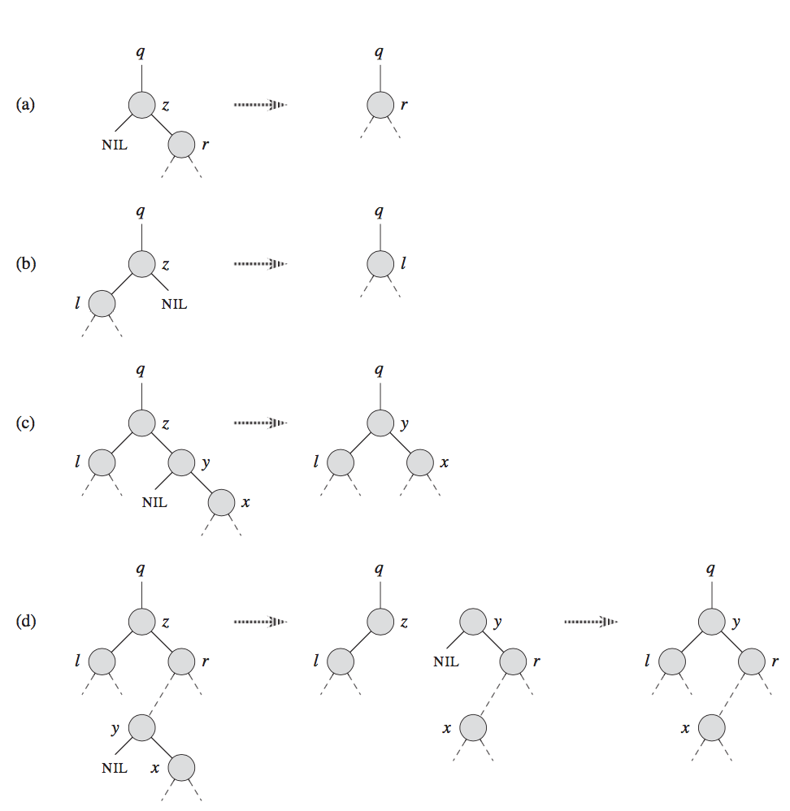

**Kjøretid:** Hver linje i _Tree-Delete_, inkludert kallet på _Transplant_, tar konstant tid, untatt kallet på
_Tree-Minimum_. Dermed har _Tree-Delete_ en kjøretid på `O(h)`, på et tree med høyde _h_

### Forventet høyde på binomisk søketre

Ved hjelp av et bevis i Cormen på side 300, kan man se at forventet høyde _h_ på et tilfeldig bygd binomisk søketre med
n distiskte elementer er _O_(lg _n_). Dvs.

`O(h) = O(lg n)`

> Det finnes søketrær som har garantert høyde h = &theta;(lg _n_) - et eksempel på et slikt tre er red-black tree.

</br></br></br>

## Dynamisk programmering <a name="of6"></a>

_Dynamisk programmering_, som splitt og hersk, løser problemer ved å kombinerer løsninger på delproblemer. Vi bruker
dynamisk programmering når delproblemene _overlapper_, og det er når delproblemer deler SUB-delproblemer. I denne
konteksten gjør splitt og hersk mer arbeid enn nødvendig, og løser samme delproblem flere ganger. En dynamisk
programmerings algoritme løser hvert deldelproblem kun en gang, og **lagrer** resultatet for at den skal slippe å regne
gjennom samme problem flere ganger.

Vi bruker gjerne dynamisk programmering ved _optimaliseringsproblemer_. Slike problemer kan ha mange mulige løsninger,
og hver løsning har en verdi og vi ønsker å finner den løsningen med optimal verdi. Det kaller vi en optimal løsning på
problemet.

-   Det er to måter å gjøre dynamisk programmering på
    -   Top Down: Memoizering med en rekursiv tilnærming
    -   Bottom Up: finn optimal løsning å fyll inn løsnings-tabell

Når vi skriver en dynamisk programmerings algoritme følger vi følgende steg:

1. Finn ut om problemet kan løses med DP (ofte det vanskeligste).
2. Identifiser variabler.
3. Identifiser relasjoner mellom variablene.
4. Finn en optimal løsning, typisk på en _bottom-up_ måte.
5. Bruk memoisering for å optimalisere løsningen.

</br>

### Optimal delstruktur:

"Det første steget i å løse et optimaliserings problem med dynamisk programmering er å karakterisere strukturen til en
optimal løsning".

**Optimal delstruktur:** En optimal løsning for problemet finnes i den optimale løsningen for del-problemene.

_Finne optimale delstrukturer:_

1. Vise at en løsning til et problem består av et valg, slik som å velge et start-kutt i en stav. Å ta dette valget gir
   en eller flere delproblemer å løse.
2. Gitt et problem, får man gitt et valg som leder til en optimal løsning. Ikke tenk på hvordan man kan ta dette valget,
   bare anta det man har fått.
3. Gitt et valg, må man velge hvilke delproblemer som følger og hvordan man best karakteriserer "rommet" av
   delproblemene.
4. Viser at løsningen til delproblemene brukt i en optimal løsning til en problem også selv må være optimale.

### Overlappende delproblemer

Det andre som må være til stede for å kunne bruke dynamisk progammering er at "rommet" til delprolemene må være "lite"
på den måten at en rekursiv algoritme av problemet løser de samme delproblemene igjen og igjen - i steden for å alltid
lage nye delproblemer.

Når en rekursiv algoritme møter på samme problem gjentatte gngaer, sier vi at optimaliseringsproblemet har
**overlappende problemer**.

> Typisk er antallet av distinkte delproblemer er polinomisk i input størrelsen.

</br>

### Delproblemgraf

Når vi tenker på dynamisk programmerings problem, bør vi forstå settet med delproblemer som involvert, og hvordan de
avhenger av hverandre.

_Delproblemgrafen_ for et problem gjengir nettopp dene informasjonen. Det er en rettet graf, med en node for hvert
distinkt delproblem. Delproblemgrafen har en rettet kant fra noden for delproblemet _x_ til noden for delproblemet _y_,
dersom en optimal løsning for _x_ avhenger av en optimal løsning av delproblemet _y_.

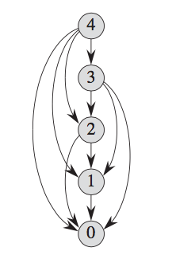

Størrelsen på en delproblemgraf `G = (V, E)` kan hjelpe oss til å forstå **kjøretiden** til en algoritme med dynamisk
programmering. Siden vi må løse hvert delproblem kun en gang, er kjøretiden summen av antall ganger vi må løse et
delproblem.

-   Typisk er kjøretiden for å finne en løsning på et delproblem proposjonal med antall _utgående_ kanter i
    delproblemgrafen

</br>

### Stavkutting

**Problem:** Gitt en stav med lengde _n_ tommer og en liste med priser _p<sub>i</sub>_ for _i_ = 1,2,...,n for å finne
maximum inntekt _r<sub>n</sub>_ ved å kutte staven opp i deler og selge de.

Vi kan kutte en stav på lengde _n_ på 2<sup>n-1</sup> forskjellige måter.

Dersom en optimal løsning kutter opp staven i _k_ deler, for en `1 ≤ k ≤ n`, da er en optimal dekomposisjon _n_ =
_i<sub>1</sub>_ + _i<sub>2</sub>_ +...+ _i<sub>k</sub>_, og gir maximum avkastning på _r<sub>n</sub>_ =
_p<sub>i<sub>1</sub></sub>_ + _p<sub>i<sub>2</sub></sub>_ +...+ _p<sub>i<sub>k</sub></sub>_.

</br>

#### Rekursiv _top-down_ implementasjon **(Ikke dynamisk programmering)**:

**Input:** En liste _p_[1...*n*] av priser og et tall _n_.

**Output:** Maksimum avkastning

```Python
def cutRod(price, n):
    if(n <= 0): # base case, hvis staven har lengde 0
        return 0 # så er prisen 0
    max_val = -1

    for i in range(0, n): # iterer gjennom lengen av staven
		# finn max mellom max_val og et rekursivt kall som vil returnere alle kombinasjoner av staver.
        max_val = max(max_val, price[i] + cutRod(price, n - i - 1))
    return max_val
```

> Kjøretiden blir her _O(2<sup>n</sup>)_ , og er derfor en **ekstremt dårlig algoritme**.

</br>

#### _Top-down_ implementasjon med memoisering (!):

**Memoisering:** Lagre en verdi som vi kan se på igjen senere

```Python
def topDownRodCutRod(price, n, result = None):
    if result == None: # initialiserer løsnings-tabellen
        result = dict()
        result[0] = 0

    if(n in result and result[n] >= 0): # her brukes del-løsningen i løsnings-tabellen
        return result[n]
    max_val = -1

    for i in range(0, n):
        max_val = max(max_val, price[i] + topDownRodCutting(price, n-i-1, result)) # rekursivt kall for å finne optimal løsning

    result[n] = max_val # legg til optimal løsning for hvert rekursivt kall
    return result[n] # Det siste kallet i call-stacken vil returnere optimal løsning for den endlige n
```

Hovedprosedyren i _topDownRodCutting_ er å initialisere en hjelpeliste result, som skjekker om vi allerede vet verdien
vi ser etter. Hvis ikke regner den ut den ønskede verdien q på den vanlige måten, lagrer den i _result[n]_ og returnerer
den.

**Iterasjoner:** Algoritmen kjører **for**-løkken _n_ ganger og gir en aritmetisk rekke med _&theta;(n<sup>2</sup>)_
iterasjoner

</br>

#### _Bottom-up_ implementasjon med memoisering:

> _Enda enklere enn top-down implementasjonen_

Bottoms-up løsning:

```Python
def bottomsUpCutRod(price, n):
    result = [0 for x in range(n+1)] # Løsnings-tabell, 0..n+1
    result[0] = 0 # Verdien til en stav med lenge 0 = 0

    for i in range(1, n+1): # For hver lenge av staven
        max_val = -1
        for j in range(i): # Finn den optimale løsningen
             max_val = max(max_val, price[j] + result[i-j-1]) # her brukes del-løsningen i løsnings-tabellen
        result[i] = max_val # Lagre del-løsning til løsnings-tabellen

    return result[n] # Returner optimal løsning for en stav av lenge n.
```

**Iterasjoner:** Algoritmen kjører dobbel **for**-løkke og gir _&theta;(n<sup>2</sup>)_ kjøretid.

### Rekonstruere en løsning fra lagrede beslutninger

Ser igjen på _stavkutting-problemet_. De tidligere løsningene av stavkuttings-problemet har kun returnert verdien av de
optimale løsningen, men ikke den faktiske løsningen: en liste med stykker av staven. Vi kan utvide den dynamiske
programmeringen til å lagre den **optimale verdien** for hvert subproblem men også et **valg** som ledet den til den
optimale verdien.

```python
def extendedBottomsUpCutRod(price, n):
    result = [0 for x in range(n+1)] # Løsnings-tabell, 0..n+1
    result[0] = 0 # Verdien til en stav med lenge 0 = 0
    s = dict()

    for i in range(1, n+1): # For hver lenge av staven
        max_val = -1
        for j in range(i): # Finn den optimale løsningen
            if max_val < price[j] + result[i-j-1]:
                max_val = price[j] + result[i-j-1] # her brukes del-løsningen i løsnings-tabellen
                s[i] = j+1
        result[i] = max_val # Lagre del-løsning til løsnings-tabellen

    return result, s
```

> s returnerer en dictionary med det høyeste kuttet brukt for alle kutt `0..n`

</br>

### LCS - Longest Common SubSequence

Gitt to sekvenser _X_ og _Y_, sier vi at sekvensen _Z_ er en felles subsekvens til _X_ og _Y_ dersom _Z_ er en
subsekvens i både _X_ og _Y_.

_F.eks._ dersom _X_ = ⟨A, B, C, B, D, A, B⟩ og _Y_ = ⟨B, D, C, A, B, A⟩, er sekvens ⟨B, C, A⟩ en felles subsekvens til
_X_ og _Y_. Sekvensen ⟨B, C, A⟩ er derimot ikke den _lengste_ felles subsekvensen (_LCS_ ) til _X_ og _Y_. Da det finnes
en lengre subsekvens som f.eks. ⟨B, D, A, B⟩.

**Lengste subsekvens-problemet:** Vi blir gitt to sekvenser, X og Y. Vi ønsker å finne den aller lengste felles
subsekvensen til _X_ og _Y_. Dette kan løses med _dynamisk programmering_:

**En rekursiv løsning:** Vi må undersøke enten en eller to delproblemer når vi skal finne _LCS_ til _X_ =
⟨_x<sub>1</sub>_, _x<sub>2</sub>_,...,_x<sub>m</sub>_⟩ og _Y_ = ⟨_y<sub>1</sub>_, y<sub>2</sub>*,...,*y<sub>n</sub>\*⟩.

-   Dersom _x<sub>m</sub>_ = _y<sub>n</sub>_ må vi finne LCS til _X_<sub>_m_ - 1</sub> og _Y_<sub>_n_ - 1</sub>.

*   Den optimale substrukturen til LCS-problemet gir da den rekursive funksjonen:

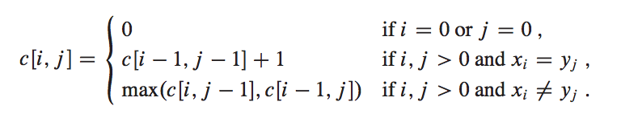

2. **Regne ut lengden på en LCS:**

    - Basert på ligning over kan vi lett skrive en eksponentiell rekursiv algoritme for å regne ut lengden til en LCS
      til to sekvenser. Til tross for dette kan vi bruke _dynamisk programmering_ til å løse problemet.
    - Prosedyren _LCS-Length_ tar inn to sekvenser _X_ og _Y_ som input, og lagrer verdiene i en matrise _c_ [0..*m*,
      0..*n* ], og fyller ut plassene i orden (dvs. fylle rad 1, så rad 2 osv).
    - Prosedyren lager også matrise _b_ [1..*m*,1..*n* ] for å hjelpe oss med å konstruere en optimal løsning. Intuitivt
      peker _b_[_i_ ][*j* ] til en element korresponderende til en optimal delproblem-løsning av _c_[ *i*, *j* ].
    - Prosedyren returnerer matrisene _b_ og _c_ og **c[*m*, *n* ]** inneholder lengden til en LCS til _X_ og _Y_

    ```python
    def LCS-Length(X, Y):
       m = len(X)
       n = len(Y)
       b = [[0]*n for row in range(m)]
       c = [[0]*(n+1) for row in range(m+1)]

    	for i in range(1,m+1):
    		for j in range(1,n+1)
    			if X[i-1] == Y[j-1]:
    				c[i][j] = c[i-1][j-1] + 1
    				b[i-1][j-1] = '↖'

    			elif c[i-1][j] ≥ c[i][j-1]:
    				c[i][j] = c[i-1][j]
    				b[i-1][j-1] = '↑'

    			else:
    				c[i][j] = c[i][j-1]
    				b[i-1][j-1] = '←'

    	return c, b
    ```

> Kjøretiden på denne prosedyren er **&theta;( _mn_ )**, siden hvert matriselement tar &theta;(1) å regne ut.

Dette kan også visualiseres i en matrise som vist under:


1. **Konstruere en LCS:**

    - Tabellen _b_ returnert av _LCS-Length_ lar oss lett konstruere en LCS til sekvensene _X_ og _Y_. VI begynner
      simpelten på _b_ [_m_ ][*n* ] og følger pilene. For hver gang vi støter på en '↖' betyr det at _x<sub>i</sub>_ =
      _y<sub>j</sub>_ er et element av LCS-en som _LCS-Length_ har funnet. Med denne metoden finner vi elementene i LCS
      i baklengs rekkefølge. Følgende prosedyre printer ut LCS til _X_ og _Y_ i riktig rekkefølge:

    ```python
    def Print-LCS(b, X, i, j):
    	if i == -1 or j == -1:
    		return

    	if b[i][j] == '↖':
    		Print-LCS(b, X, i-1, j-1)
    		print(X[i])

    	elif b[i][j] == '↑':
    		Print-LCS(b, X, i-1, j)

    	else:
    		Print-LCS(b, X, i, j-1)
    ```

> Denne prosdyren bruker **_O(m + n)_** tid, siden den dekrementerer minst en av _i_ og _j_ for hvert rekursive kall.

### Kjøretid

Kjøretiden til en algoritme i _dynamisk programmering_ avhenger av et produkt av to faktorer: **Antall delproblemer** og
hvor mange **valg** vi har i hvert delproblem.

-   I stavkuttingen hadde vi _&theta;(n)_ delproblemer, og max _n_ valg i hvert delproblem, altså fikk vi kjøretid
    _Ο(n<sup>2</sup>)_

### 0-1 Knapsack

Det såkalte _ryggsekkproblemet_ kommer i flere varianter. Den _fraksjonelle_ varianten er letter å løse: Man tar bare
med seg så mye som mulig av den dyreste gjenstanden, og fortsetter nedover på lista, sortert etter kilopris. I
0-1-varianten, derimot, blir ting litt vanskeligere - her må man ta med en hel gjenstand eller la den ligge.

Akkurat som i f.eks. [Floyd-Warshall](#floyd) baserer dekomponeringen seg på et _ja-nei-spørsmål_, i dette tilfellet;
«Skal vi ta med gjenstand _i_ ?». For hver av de to mulighetene sitter vi igjen med et delproblem som vi løser
rekursivt. Som vanlig tenker vi oss at dette er siste trinn og antar at vi har gjentstander 1,...,_i_ tilgjengelige. Da
har vi to muligheter:

1. **Ja**, vi tar med gjenstand _i_. Vi løser så problemet for gjenstander 1,...,_i-1_ men der kapasiteten er redusert
   med _w<sub>i</sub>_. Vi legger så til _v<sub>i</sub>_ til slutt.
2. **Nei**, vi tar ikke med gjenstand _i_. Vi løser så problemet for gjenstander 1,..,_i-1_, men kan fortsatt bruke hele
   kapasiteten. Til gjengjeld får vi ikke legge til _v<sub>i</sub>_ til slutt.

Situasjonen er illustrert i figuren under, der hver rute representerer en delløsning (en celle i løsningstabellen,
f.eks) og pilene er avhengigheter, som vanlig. Vi kan sette opp en rekursiv løsning slik:

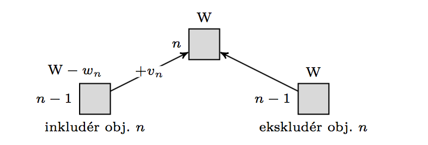

```pseudocode
KNAPSACK(n, W)
1	if n == 0
2		return 0
3	x = KNAPSACK(n-1, W)
4	if W < w_n
5		return x
6	else y = KNAPSACK(n-1, W - w_n) + v_n
7		return max(x, y)
```

> Denne prosedyren vil naturligvis ha eksponentiell kjøretid.

#### Dette er ikke polynomisk!

_0-1-knapsack_ er et såkalt [NPC](#of14) problem, og det derfor ingen som har funnet noen polynomsk løsning på det.

Kjøretiden til _Knapsack_ er _&theta;(nW)_, siden det er _nW_ delproblemer og vi utfører en konstant mengde arbeid per
delproblem. I forbindelse med NP-kompletthet holder vi oss til _antall bits_ i input, i en rimelig encoding. Størrelsen
blir da _&theta;(n + lg W)_, siden vi bare trenger &theta;(lg _W_) bits for å lagre parameteren W.

Poenget er altså at _W_ vokser eksponentielt som funksjon av lg _W_, og kjøretiden er, teknisk sett, eksponentiell. Vi
lar _m_ være antall bits i _W_, og kan skrive kjøretiden som: $T(n, m) = θ(n2^m)$

Da er det tydelig at dette ikke er en polynomsik kjøretid. Kjøretider som er polynomisk hvis vi lar et tall fra input
være med som parameter til kjøretiden (slik som &theta;(_nW_), der W er et tall fra input, og ikke direkte en del av
problemstørrelsen) kaller vi _pseudopolynomiske_. (ofte lureoppgave på eksamen)

</br></br></br>

## Grådige algoritmer <a name="of7"></a>

En **grådig algoritme** tar alltid et valg som ser best ut der og da. Som betyr, den tar en _lokalt optimalt valg_ i håp
om at det vil lede til den _globale optimale løsningen_.

For å kunne benytte en grådig algoritme må problemet ha:

-   Optimal sub-struktur
-   Grådighetsegenskapen

_Husk:_ Et problem har **optimal delstruktur** dersom en optimal løsning for problemet finnes i den optimale løsningen
for del-problemene. Vi kan bevise optimal substruktur ved å bruke induksjon på delproblemene til å vise at det å ta det
grådige valget i hvert steg produserer en optimal løsning.

</br>

### Grådighetsegenskapen:

Et problem har denne egenskapen dersom man kan ende opp med en optimal løsning ved å velge ut det som ser best ut i
øyeblikket.

_Eksempel_: Hvis du skal betale for en vare med mynter, vet du at du alltid vil ende opp med å betale minst antall
mynter dersom du heletiden legger til den mynten med høyest verdi i den endlige løsningen. Man må altså ikke regne ut
alle kombinasjoner av mynter.

Det er her forskjellen mellom grådige algoritmer og _dynamisk programmering_ ligger. I dynamisk programmering tar vi
valg på hvert steg, men som vanligvis avhenger av løsningen på delproblemene. Og i motsetning til dynamisk programmering
tar grådige algoritmer sitt første valg, før den løser noen av delproblemene.

</br>

#### Elementer ved den grådige strategien

Vi designer gråde algoritmer i henhold til følgende punkter:

1. Gitt et optimaliseringsproblem skal vi ta et valg og står igjen med ett subproblem å løse.
2. Vis at det alltid er en optimal løsning på det originale problemet som tar grådige valget, slik at det grådige valget
   alltid er trygt.
3. Demonstrer den optimale substrukturen, ved å vise at dersom vi tar det grådige valget, gjenstår det et delproblem som
   har den egenskapen at hvis vi kombinerer en optimal løsning på subproblemet og det grådige valget vi tok, kommer vi
   frem til en optimal løsning på det originale problemet.

</br>

### Aktivitetutvelgelse

La oss anta et set _S_ = {_a_<sub>1</sub>, _a_<sub>2</sub>,...,_a_<sub>_n_</sub>} av _n_ foreslåtte aktiviteter som
ønsker å - for eksempel bruke en gymhall, som kun kan brukes til en aktivitet av gangen. Hver aktivitet
_a_<sub>_i_</sub> har en **start-tid** _s<sub>i</sub>_ og en **slutt-tid** _f<sub>i</sub>_, hvor 0 ≤ _s<sub>i</sub>_ ≤
_f<sub>i</sub>_ < ∞. Dersom en aktivitet _a_<sub>_i_</sub> er valgt i intervallet [_s<sub>i</sub>_, _f<sub>i</sub>_ ),
er aktivetetene _a_<sub>_i_</sub> og _a_<sub>_j_</sub> **kompatible** dersom intervallene [_s<sub>i</sub>_,
_f<sub>i</sub>_ ) og [_s<sub>j</sub>_, _f<sub>j</sub>_ ) ikke overlapper.

I aktivitetutvalg-problemet ønsker vi å velge max-størrelse subset av kompatible aktiviteter. Vi antar at aktivitetene
er sortert i stigende rekkefølge etter _slutt-tid_:

#### Det grådige valget:

Problemet har grådig valg egenskapen fordi man kan velge en aktivitet og legge det til i den optimale løsningen uten å
først måtte løse alle delproblemene. På denne måten sparer vi oss for mye arbeid

Vi må velge den aktiviteten i _S_ med tidligst _slutt-tid_, siden det lar det være mer tid igjen til de andre
aktivitetene.

Dersom vi tar det grådige valget, har vi kun ett delproblem å løse: Finne en aktivitet som starter etter _a<sub>1</sub>_
slutter. Vi må finne en aktivitet som slutter etter aktivitet _a<sub>1</sub>_

#### En rekursiv grådig algortime

Prosedyren _Recursive-Activity-Selector_ tar aktivitetene _A_[*a*<sub>1</sub>,..*a<sub>n</sub>*] og start- og
slutt-tiden til aktivitetene representert som listene _s_ og _f_, indeksen _k_ som definerer subproblemet
_S<sub>k</sub>_ og størrelsen _n_ til det originale problemet. Antar A som global variabel med aktiviteter og henter
derfra.

```pseudocode
RECURSIVE-ACTIVITY-SELECTOR(s, f, k, n)
1	 m = k + 1
2	 while m ≤ n and s[m] < f[k]
3		 m = m + 1
4	 if m ≤ n
5		 return {A[m] ∪ RECURSIVE-ACTIVITY-SELECTOR(s,f,m,n)}
6	 else return ∅
```

Vi kan også konvertere den rekursive prosedyren til en iterativ en. Prosedyren _Greedy-Activity-Selector_ er en iterativ
versjon av prosedyren over. Den antar forøvrig at input-aktivitetene er sortert i stigende rekkefølge etter slutt-tid.
Antar fortsatt A som global variabel med aktiviteter og henter derfra.

```pseudocode
GREEDY-ACTIVITY-SELECTOR(s, f)
1	 n = s.length
2	 res = [A[1]]
3	 k = 1
4	 for m = 2 to n
5	 	 if s[m] ≥ f[k]
6	 	 	 res += A[m]
7	 		 k = m
8	 return res
```

**Kjøretid:** Begge algoritmen planlegger _n_ aktiviteter på &theta;(_n_) tid.

</br>

### Fractional knapsack problem

Samme oppsett som i _0-1-knapsack_, men man kan ta med seg deler (_fractions_) av elementer (_items_), istedet for å
måtte ta et binært (0-1) valg for hvert element. Begge ryggsekkproblemene utviser optimal substruktur. Vi kal løse det
fraksjonelle ryggsekkproblemet med en grådig strategi.

For å løse det fraksjonelle problemet, må vi regne ut kiloprisen _v<sub>i</sub>_ / _w<sub>i</sub>_ for hvert element.
Ved å følge den gråde strategien tar vi så mye som mulig av det elementet med høyest kilopris, og deretter så mye som
mulig av det nest dyreste elementet, til ryggsekken når sin vektgrense _W_.

**Kjøretiden:** Siden algorimetn må sortere elementene med tanke på kilopris, kjører den grådige algoritmen på _O_(_n_
lg _n_) tid.

</br>

### Huffmann-koder

Huffmann-koder komprimerer data veldig effektivt, og gir besparelser på 20-90%. Vi ser her på "prefix-frie koder". Når
vi skal encode for binær kode, skiller vi bare mellom kodeordene som representerer karakterene i fien.

Når en skal skrive et binært tre som decoder/encoder en tekst, lager man et binærtre der bladene er gitte tegn, og
kantene er nummerert med 0 eller 1. Der venstre kant er 0 og høyre kant er 1. Så når man leser fra en enkrypert kode, så
betyr 0: Gå til venstre barn, og 1: Gå til høyre barn.

_eksempel:_ vi skrive _abc_ fra grafen under som 11|100|0 = 111000

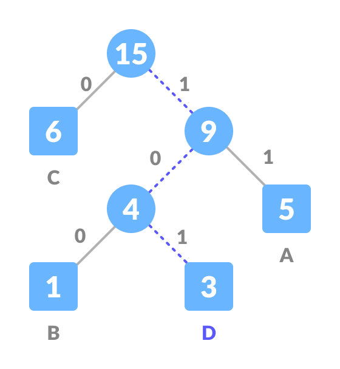

Størrelsen for eksemepelet over ville uten huffman-enconding gitt en størrelse på: `15tegn * 8bit = 120bits`

Beregning av størrele etter utført huffman-enconding kan man se i grafen under: Character | Frequency | Code | Size :--:
| :--: | :--: | :--: A | 5 | 11 | 5*2 = 10 B | 1 | 100 | 1*3 = 3 C | 6 | 0 | 6*1 = 6 D | 3 | 101 | 3*3 = 9 4 \* 8 =
32bits | 15 bits | | 28 bits Dette gir en total størrelse på: 32 + 15 + 28 = 75

</br>

> En optimal kode for en fil er alltid representert som en fullt binærtre.

Antall bit for å encode en fil er

$\displaystyle B(T) = \sum_{c \in C} c.\text{freq} \cdot d_T(c)$

> der _c.freq_ er frekvensen til ett tegn og d<sub>_T_</sub>(_c_) er lengden på kodeordet for _c_.

</br>

#### Konstruere Huffmann-koder

Man starter med et sett _C_ med _n_ tegn, og at hvert tegn c ∈ C har en attributt _c.freq_ som betegner dens frekvens.
Algoritmen _Huffman_ bygger et tree _T_ korresponderende til den optimale koden på en _bottom-up_ måte.

1. Algoritmen legger alle tegnene i en kø
2. Deretter fjerner den de to nodene/tegnene _x_ og _y_ med minst frekvens fra køen, og lager en ny node _z_ med _x_ og
   _y_ som barn, og _z.freq_ = _x.freq_ + _y.freq_, og legger _z_ til køen.
3. Til slutt er det kun en rot igjen i køen, og dette er roten til Huffmann-treet, som returneres.

> På denne måten vil elementene med lavest frekvens få lengst vei i treet.

```
HUFFMAN(C)
1	 n = |C|
2	 Q = C
3	 for i = 1 to n - 1
4	 	 allocate a new node z
5		 z.left = x = EXTRACT-MIN(Q)
6		 z.right = y = EXTRACT-MIN (Q)
7		 z.freq = x.freq + y.freq
8		 INSERT(Q, z)
9	 return EXTRACT-MIN(Q)		// returnerer roten i treet
```

**Kjøretid:** `O(n lg n)` med binær-heap

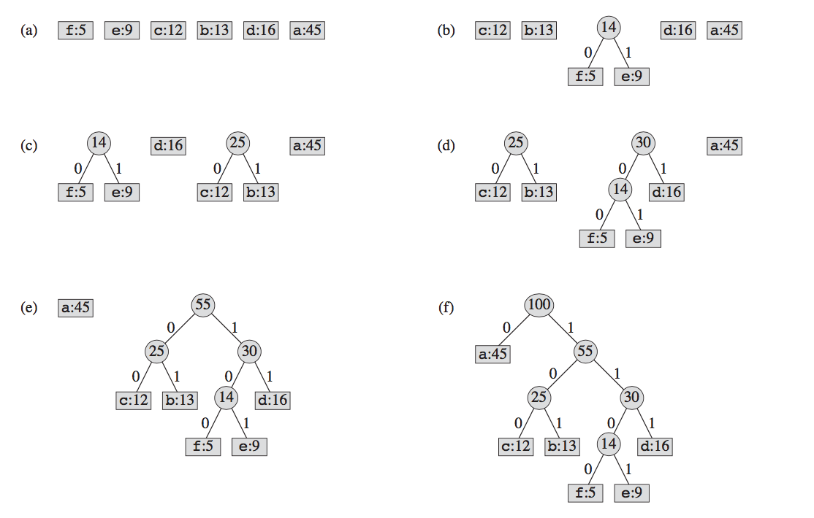

**Bevise korrektheten til Huffmans algoritme:** For å vise at den er korrekt må vi vise at den utviser
_grådighetsegenskapen_ og har en _optimal substruktur_.

</br></br></br>

## Traversering av grafer <a name="of8"></a>

### Representasjon av grafer

Vi kan velge mellom to standard måter å representere en graf `G = (V, E)`; som ett sett nabolister - eller som en
nabomatrise. Begge måtene kan brukes til rettede og urettede grafer. Naboliste representasjonen gir en mer kompakt måte
å representere en **spredt** (_eng. sparse_) graf - der $|E|$ **er mye mindre enn** $| V |^2$. I de fleste algoritmene i
boken antar vi at input-grafen er representert på en nabo-liste form. Vi kan også bruke en nabomatrise når vi har en
**tett** (_eng. dense_) graf - der $|E|$ **er nær** $|V|^2$, eller når vi kjapt trenger å finne ut om det er en kant som
binder to gitte noder.

**Urettede grafer:** &nbsp; a) graf &nbsp; b) naboliste &nbsp; c) matrise

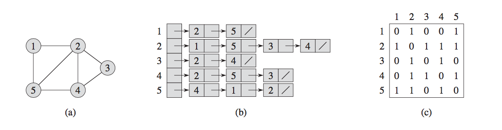

**Rettede grafer:** &nbsp; a) graf &nbsp; b) naboliste &nbsp; c) matrise

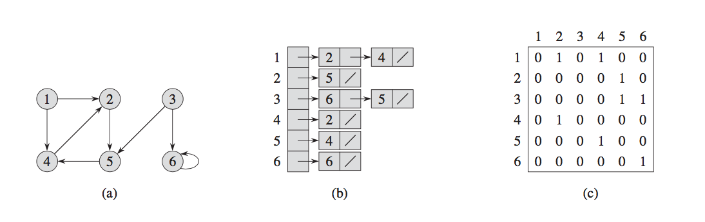

**Naboliste:** En liste med $|V|$ elementer består aven liste med $deg(V_i)$ elementer

> Krever &theta;(_V_ + _E_) lagringsplass.

**Nabomatrise:** En $|V| \times |V|$ matrise $A = a_{ij}$.

> Krever &theta;(_V_ <sup>2</sup>) lagringsplass.

</br>

### Bredde-først søk - BFS

Bredde-først søk er en av de enkleste algoritmene for å søke i en graf. Gitt en graf `G = (V, E)` og en gitt **kilde**
_s_, kan bredde-først-søk systematsik utforske kantene i G, for å finne hver node som kan nås fra _s_. Den regner ut
avstanden (minste antall kanter) fra _s_ til hver node node man kan nå. Den produserer også ett _bredde-først tre_, med
roten _s_ som inneholder alle noder som kan nås.

For hver node _v_ som kan nås fra _s_, den enkle stien i bredde-først treet fra _s_ til _v_ korresponderer til den
"korteste veien" fra _s_ til _v_ i G. Algoritmen fungerer på både rettede og urettede grafer. Algoritmen finner alle
noder med avstand _k_ fra _s_, før den finner noen noder med avstand _k_ + 1.

Algoritmen konstruerer et bredde-først tre, først med bare sin rot _s_. Den kan først utforske en ny node _v_ etter at
den har scannet nabolisten til en allerede funnet node _u_. Deretter vil noden _v_ og kanten (_u_, _v_) bli lagt til i
treet. Vi sier at _u_ er **forgjengeren** eller **forelderen** til _v_ i treet. Siden hver node kun kan bli funnet _en_
gang, har nodene kun en forelder.

Implementasjonen av BFS prosedyren under antar at input-grafen `G = (V, E)` er representert i en naboliste. Vi lagrer
tilstanden til hver node _u_ &in; _V_ i attributten _u.color_, hvor hvit ikke er oppdaget, grå venter på å bli
traversert, og sort er ferdig. Forgjengerer til _u_ ligger i attributten _u.&pi;_. Dersom noden mangler noen av disse
attributtene vil de være satt til å være NIL. Algoritmen bruker også en FIFO kø Q, for å håndtere settet med gråfargede
noder.

-   Det at vi bruker en FIFO-kø er det som lar BFS finne de korteste stiene til alle noder, siden vi utforsker grafen
    "lagvis" utover.

```pseudocode
BFS(G, s)
1	 	for each vertex u ∈ G.V - {s}		//setter farge, avstand og nabo for hver node - O(V)
2			u.color = WHITE
3		 	u.d = ∞
4		 	u.π = NIL
5	 	s.color = GRAY
6	 	s.d = 0
7	 	s.π = NIL
8	 	Q = ∅
9		ENQUEUE(Q,s) 				// O(1)
10		while Q ≠ ∅
11			u = DEQUEUE(Q)			// O(1)
12			for each v ∈ G.Adj[u]	// Summen av lengden til alle nabolistene er ϴ(E), og tid brukt tid på å scanne disse blir - O(E)
13				if v.color = WHITE
14					v.color = GRAY
15					v.d = u.d + 1
16					v.π = u
17					ENQUEUE(Q, v)		// O(1)
18			u.color = BLACK
```

**Kjøretiden:**

-   Operasjonene for _Enqueueing_ og _Dequeueing_ tar *O(*1*)* tid, og da blir total tid brukt på kø-operasjoner _O(V)_.
-   Siden prosedyren skanner igjennom nabolisten til hver node kun når noden blir _dequeuet_, går den igjennom hver
    naboliste på det meste én gang. Siden summen av lengden på alle nabolistene er &theta;(_E_).
-   Initialiseringen på starten er O(_V_).
-   Den totale kjøretiden for BFS er derfor **`O(V + E)`**.

**Kjøring av prosedyren BFS:**

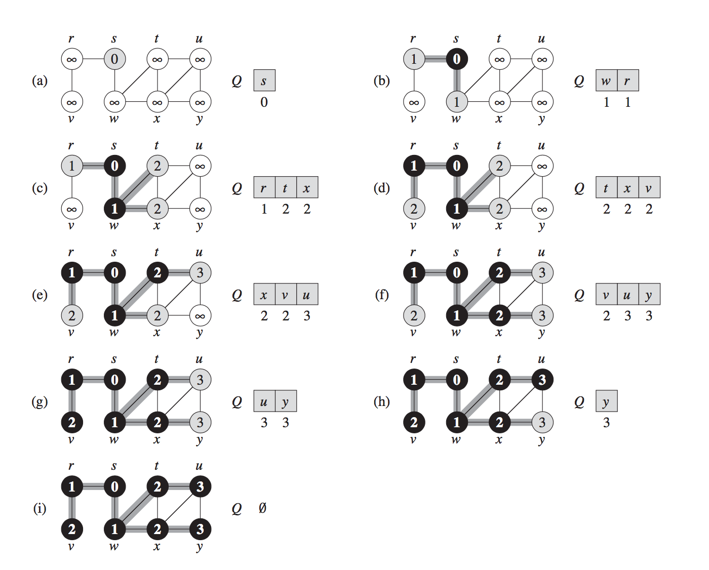

**Bredde-først trær:**

Prosedyren BFS bygger et bredde-først tre når den søker i grafen. Treet korresponderer til &pi; attributten. For en graf
_G_ = (_V_, _E_) med en kilde _s_, definerer vi forgjenger subgrafen til _G_ som _G_<sub>&pi;</sub> =
(_V_<sub>&pi;</sub>, _E_<sub>&pi;</sub>). Vi kaller kantene i E<sub>&pi;</sub> for **tre-kanter**. I dette kapittelet
antas det at alle kanter har en enhet vekt, dvs. lik, siden de egentlig ikke har noen vekt.

#### Print-Path

Følgende prosedyre printer ut nodene til den korteste veien fra _s_ til _v_, der en antar at BFS allerede har konstruert
et bredde-først tre.

```pseudocode
PRINT-PATH(G, s, v)
1	 if v == s
2		 print s
3	 elif v.π == NIL
4		 print "no path from " s " to " v " exists"
5	else
6		 PRINT-PATH(G,s,v.π)
7		 print v
```

> Denne prosedyren kjører i linær tid i antall noder i veien som printes, siden hvert rekursive kall er for en vei en
> node kortere.

</br>

### Dybde-først søk

Strategien med dybde-først søk er som navnet impliserer - søke dypere i grafen når det er mulig. Algoritmen utforsker
kantene ut fra den nyligste oppdagede noden _v_, som fortsatt har ikke-utforskede kanter. Når alle av _v_ 's kanter har
blitt utforsket, går prosedyren tilbake til noden _v_ kom fra for å se etter ikke-utforskede kanter.

Som i bredde-først søk, vil dybde-først søk når den oppdager en node _v_ i en naboliste til en allerede oppdaget node
_u_, notere dette ved å sette `v.π = u`. I motsetning til bredde-først søk, der forgjengerne former et tre, vil
**forgjenger delgrafen** til DFS være litt annerledes. Vi lar _G_<sub>&pi;</sub> = (_V_, _E_<sub>&pi;</sub>), der
_E_<sub>&pi;</sub> = {(_v.π_, v) : v &in; V and v.π ≠ NIL}.

Forgjenger subgrafen til DFS danner derfor en **dybde-først skog** med flere **dybde-først trær**. Kantene i
E<sub>&pi;</sub> er _tre-kanter_.

-   Som i BFS, farger dybde-først søk nodene som den finner underfveis i prosedyren for å markere deres status: Hver
    node farges initiellt `WHITE` , og blir `GRAY` når de blir oppdaget i søket, og blir farget `BLACK` når de er
    ferdige, og det er når nabolisten har blitt utforsket fullstendig.

I tillegg til å lage en _dybde-først skog_, **tidsstemlpler** DFS også hver node. Hver node _v_ har to tidsstempler:

-   Første tidsstempel - _`v.d`_ har lagret når _v_ først ble funnet og farger _v_ `GRAY`.
-   Andre tidsstempel - _`v.f`_ har lagret når søket slutter å se på _v_ 's naboliste, og farger _v_ `BLACK`.

Disse tidsstempelene gir viktig informasjon om strukturen til grafen og generelt hjelpende når man skal resonnere over
oppførselen til dybde-først søket.

Prosedyren DFS under lagrer når den oppdager noden _u_ i attributten _u.d_ og når den blir ferdig med noden _u_ i _u.f_.
Disse tidsstempelene er tall mellom 1 og 2 | V |, siden det er to tidsstempeler for hver node (|V| noder).

Input er en graf G som kan være rettet eller urettet, og variabelen time er en global variabel som brukes for
_tidsstempling_.

```pseudocode
DFS(G)
1	 for each vertex u ∈ G.V
2	 	 u.color = WHITE
3		 u.π = NIL
4	 time = 0
5	 for each vertex u ∈ G.V
6		 if u.color == WHITE
7				 DFS-VISIT(G, u)


DFS-VISIT(G, u)
1	 time = time + 1			// white vertex u has just been discovered
2	 u.d = time
3	 u.color = GRAY
4	 for each v ∈ G.Adj[u]		// explore (u, v)
5		 if v.color == WHITE
6		 	 v.π = u
7			 DFS-VISIT(G, v)
8	 u.color = BLACK				// blacken u; it is finished
9	 time = time + 1
10	 u.f = time
```

**Kjøring av algoritmen:**

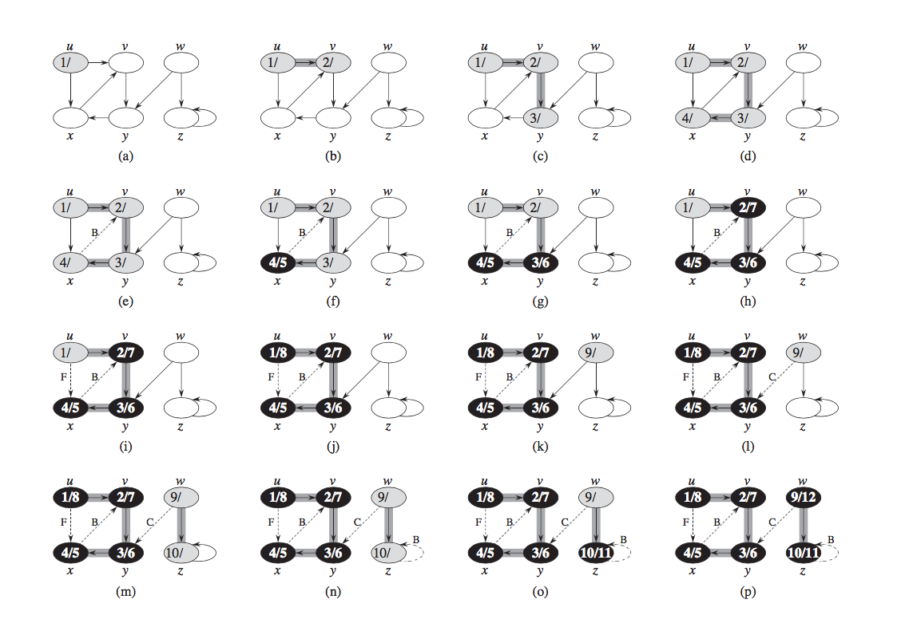

**Kjøretid:**

-   Løkkene på linje 1-3 og linje 5-7 i DFS tar **&theta;(_V_)**, ekslusiv tiden det tar å kjøre kallet på _DFS-Visit_.
-   Prosedyren _DFS-Visit_ blir kalt på nøyaktiv én gang per node _v_ &in; _V_, siden noden _u_ som _DFS-Visit_ blir
    kalt med må være `WHITE`og det første _DFS-Visit_ gjør er å farge den `GRAY`.

    -   Under utføringen av _DFS-Visit(G, v)_ kjøres løkken på linje 4-7 |Adj[*v*]| ganger. Siden ∑|Adj[_v_| =
        &theta;(_E_), blir den totale kostnader for linje 4-7 i _DFS-Visit_ **&theta;(_E_)**

-   Den total kjøretiden til DFS blir derfor **&theta;(_V_ + _E_)**

#### Egenskaper til dybde-først søk

Den mest essentielle egenskapen til DFS er at forgjenger subgrafen _G_<sub>&pi;</sub> former en skog av trær, siden
strukturen til dybde-først trærne speiler strukturen til de rekursive kallene på _DFS-Visit_.

En annen viktig egenskap til DFS er oppdagelse og slutt tiden har **parantes struktur**. Dersom vi representerer funnet
av noden _u_ med en venstre parantes "(_u_" og representerer slutten til noden med høyre parantes "u)", da former
historien av "discoveries" og "finishes" et vellformet uttrykk:

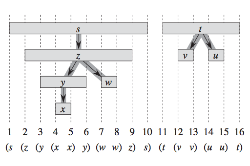

</br></br>

#### Parantesteoremet

I ethvert dybde-først søk av en (rettet eller urettet) graf _G_ = (_V_, _E_), hvor for ethvert par noder _u_ og _v_,
holder akkurat ett av disse tre forholdene:

-   Intervallene [*u.d*, *u.f*] og [*v.d*, *v.f*] er helt disjunkte, og hverken _u_ eller _v_ er en etterkommer den
    andre i dybde-først skogen.
-   Hele intervallet [*u.d*, *u.f*] er i intervallet [*v.d*, *v.f*], og _u_ er en etterkommer av _v_ i ett
    dybde-først-tre.
-   Hele intervallet [*v.d*, *v.f*] er i intervallet [*u.d*, *u.f*], og _v_ er en etterkommer av _u_ i ett
    dybde-først-tre.

#### Klassifisering av kanter

Vi definerer fire typer kanter i dybde-først skogen _G_<sub>&pi;</sub> produsert av et dybdeførst søk på G:

1. **Tree edges** er kanter i dybde-først skogen _G_<sub>&pi;</sub>. Kanten (_u_, _v_) er en _tree edge_ dersom _v_
   først ble funnet ved utforskning av kanten (_u_, _v_).
2. **Back egdes** er kantene (_u_, _v_) som forbinder en node _u_ til en forgjenger _v_ i et dybde-først tre. Vi ser på
   selv-løkker, som kan forekomme i rettede grafer til å være _back egdes_.
3. **Forward edges** er de _non-tree edges_ (_u_, _v_) som forbinder en node _u_ til en etterkommer _v_ i ett
   dybde-først tre.
4. **Cross edges** er alle de andre kantene. De kan gå mellom noder i samme dybde-først tre, så lenge en av nodene ikke
   er en forgjenger til den andre, eller så kan de gå mellom noder i forskjellige dybde-først trær.

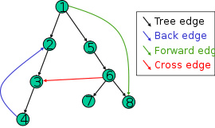

I DFS har vi klassifisert kantene slik:

-   `WHITE` har indikert en _tree edge_
-   `GRAY` har indikert en _back egde_
-   `BLACK` har indikert en _forward_ eller _cross edge_

#### Implementere DFS med en Stack

Prosedyren BFS, som skrevet om over, kan tilpases til å oppføre seg nesten helt likt som DFS. Dette kan en gjøre ved å
bytte ut \*FIFO-køen **Q\*** med en _LIFO-kø_, eller _stakk_ (eng. _stack_). Vi mister da tidsstemplene (_v.d_ og
_v.f_), men rekkefølgen noder farges grå og svarte på vil bli den samme.

Slik DFS er implementert over har den _ingen startnode_, men starter bare fra hver node etter tur, til den har nådd hele
grafen. Derfor kan man si at *BFS*s slekter mer på _DFS-Visit_.

Grunnen til at en LIFO-kø (_stack_) gir oss samme atferd som en rekursiv traversering (altså DFS) er at vi egentlig bare
simulerer hvordan rekursjon er implementert:

-   Internt bruker maskinen en _kallstakk_, der informasjon om hvert kall legges øverst og hentes frem når rekursive
    kall er ferdige.

```pseudocode
STACK-DFS(G, s)
1	 	for each vertex u ∈ G.V - {s}
2			u.color = WHITE
3		 	u.d = ∞
4		 	u.π = NIL
5	 	s.color = GRAY
6	 	s.d = 0
7	 	s.π = NIL
8	 	S = ∅
9		PUSH(S, v)
10		while Q ≠ ∅
11			u = POP(S)
12			for each v ∈ G.Adj[u]
13				if v.color = WHITE
14					v.color = GRAY
15					v.d = u.d + 1
16					v.π = u
17					PUSH(S, v)
18			u.color = BLACK
```

</br>

### Topologisk sortering

Vi kan bruke **dybde-først** søk til å **topologisk sortere** en rettet asyklisk graf eller en _DAG_ (_eng. directed
acyclic graph_). En _topologisk sortering_ av en DAG `G = (V, E)` er en lineær ordning av alle nodene slik at dersom G
inneholder en node _v_ med egde til _u_, da kommer _u_ før _v_ i ordningen.

Vi kan se på topologisk sortering av en graf som en ordning av nodene langs en horisontal linje slik at alle de _rettede
kantene_ går fra venstre mot høyre. Man begynner med noden som ikke har noenkanter inn til seg.

```pseudocode
TOPOLOGICAL-SORT(G)
1	 call DFS(G) to compute finishing times v.f for each vertex v
2	 as each vertex is finished, insert it onto the front of a linked list
3	 return the linked list of vertices
```

Prosedyren vil returnere en lenket liste med topologisk sorterte noder i synkende rekkefølge med hensyn på _v_._f_
_(finish-time)_, som du ser i figuren under:

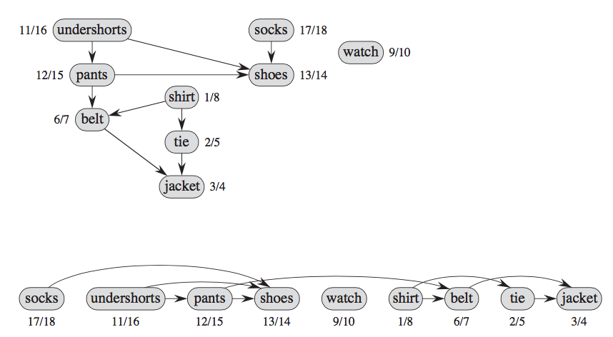

**Kjøretid:** Vi kan utføre topologisk sortering på **`ϴ(V + E)`** tid, siden dybde-først søk bruker ϴ(_V_ + _E_) tid og
det tar O(1) tid å innsette hver av de | _V_ | nodene foran i den lenkede listen.

</br>

## Minimale spenntrær <a name="of9"></a>

### Disjunkte mengder

En disjunkt-sett datastruktur vedlikeholder en samling S = {_S_<sub>1</sub>, _S_<sub>2</sub>,...,_S_<sub>_k_</sub>} av
disjunkte dynamiske sett. Vi identifiserer hvert sett med en representativ, som er et medlem av settet.

Som i de andre dynamisk-sett implementasjonene vi har sett på, representerer vi hvert element i ett sett med et objekt.
La _x_ være et objekt, ønsker vi å støtte følgende funksjoner:

-   `MAKE-SET(x)` lager et nytt sett med dens eneste medlem, og dens representativ, som _x_. Siden settene er disjunkte
    krever vi at _x_ ikke allerede ikke er i et annet sett.

-   `UNION(x, y)` forener de dynamiske settene som inneholder _x_ og _y_, la oss si _S_<sub>_x_</sub> og
    _S_<sub>_y_</sub>, inn i ett nytt sett som er unionen av disse to settene.

    -   Representativen til det resulterende settet kan være et vilkårlig element i _S_<sub>_x_</sub> ∪
        _S_<sub>_y_</sub>, selvom mange implementasjoner av _Union_ velger en av representantene til \*_S_<sub>_x_</sub>
        og _S_<sub>_y_</sub>, som den nye representanten.
    -   Siden vi krever at settene i _S_ er disjunkte må vi nå fjerne _S_<sub>_x_</sub> og _S_<sub>_y_</sub> fra
        samlingen _S_.

-   `FINDSET(x)` returnerer en peker til representanten til det (unike) settet som inneholder _x_

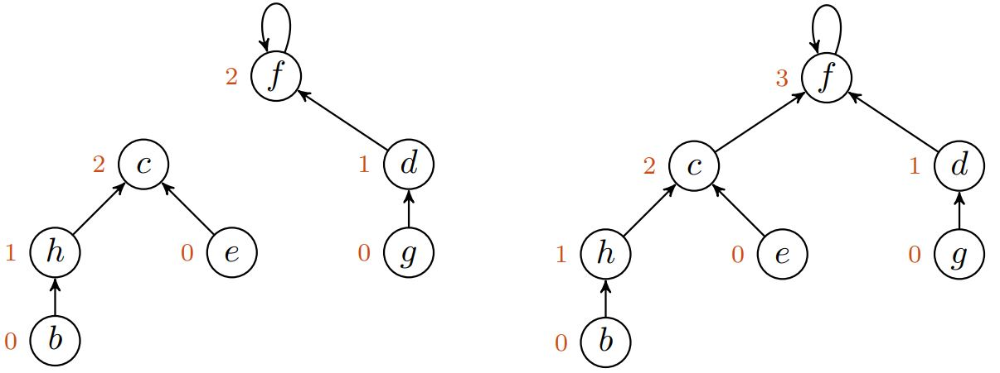

_Illusterer hvordan to disjunkte menger kobles sammen ved å først finne roten ved hjelp av `findset(x)`, for så å og
kalle `union(x,y)` på dem._

En av de mange bruksområdene til disjunkte-sett datastrukturen er å kunne definere de koblede komponenetene i en urettet
graf. Prosedyren _Connected-Components_ bruker de disjukte-sett operasjonene til å regne ut de koblede komponentene i
grafen. Når _Connected-Components_ har prosessert grafen, kan prosedyren _Same-Component_ svare på om to noder er i den
samme koblede komponenten.

```pseudocode
CONNECTED-COMPONENTS(G)
1	 for each vertex v ∈ G.V
2		 MAKE-SET(v)
3	 for each edge (u, v) ∈ G.E
4		 if FIND-SET(u) ≠ FIND-SET(v)
5			 UNION(u, v)
```

```pseudocode
SAME-COMPONENT(u, v)
1	 if FIND-SET(u) == FIND-SET(v)
2		 return True
3	 return False
```

### Disjunkte-sett skoger

En raskere implementasjon av disjunkte sett er at vi representerer settene med rotfestede trær, der hver node inneholder
ett medlem og hvert tre representerer ett sett. I en _disjunkt-sett skog_ peker hvert element kun til sin forelder.
Roten i hvert tre innholder representativen og sin egen forelder.

Vi utfører de tre disjunkt-sett operasjonene følgende. Operasjonen _Make-Set_ lager helt enkelt et tre med kun en node.
Vi bruker _Find-Set_ ved å følge forelder-pekerne elt til vi finner roten av treet. _Union_ operasjonen får roten til
det ene treet til å peke til roten til det andre.

#### Pseudokode for disjunkte-sett skoger

For å implementere en disjunkt-sett skog med union-av-rang hierarki må vi holde styr på rangene, dvs at hver node _x_
får attributten _x.rank_, som er en øvre grense på høyden til _x_.

```pseudocode
MAKE-SET(x)
1	x.p = x
2	x.rank = 0


UNION(x, y)
1	LINK(FIND-SET(x), FIND-SET(y))

LINK(x, y)
1	if x.rank > y.rank
2		y.p = x
3	else
4		x.p = y
5		if x.rank == y.rank
6			y.rank = y.rank + 1

FIND-SET(x)
1	if x ≠ x.p
2		x.p = FIND-SET(x.p)
3	return x.p
```

**Kjøretiden:** Når vi skal regne på samlet kjøretid for disse algoritmene får vi O(_m_ lg _n_) der _n_ er antall
`MAKE-SET` operasjoner, og _m_ er total antall `MAKE-SET`, `UNION` og `FIND-SET` operasjoner. Vi antar at de _n_
_Make-Set_-operasjonene er de første _n_ operasjonene som blir gjort.

</br>

### Minimale spenntrær - MST

Vi lar _G_ = (_V_, _E_ ) være en urettet graf. Vi ønsker å finne et asyklisk subset _T_ ⊆ _E_, som kobler alle nodene
sammen og der den totale vekten

$\displaystyle w(T)= \sum_{(u,v)\in T} w(u,v)$

er minimert. Siden _T_ er asyklisk og kobler sammen alle nodene må den forme et tre, som vi kaller ett **spenntre**, da
den "spanner" grafen _G_. Vi kaller problemet av å definere treet _T_ _det minimale spenntre problemet_.

Vi skal se på to algoritmer for å løse MST-problemet: Kruskal's algoritme og Prim's algoritme. Begge algoritmene er
[grådige algoritmer](#of7) og på hvert steg må algoritmene ta ett av flere mulige valg. Vi skal også se på en generisk
MST metode, som lager et minimalt spenntre ved å legge til en kant av gangen. Deretter skal vi se på _Krusals_, som
likner på _Connected-Components_ algoritmen. Vi skal også se på _Prims_ algoritme, som minner om _Djikstra's_ korteste
vei algoritme.

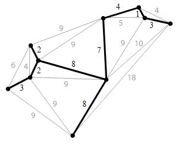

_Et minimalt spenntre_

</br> </br>

#### Bygge et minimalt spenntre

Antat at vi har en sammenhengende, urettet graf _G_ = (_V_, _E_ ) med en vektfunksjon _w_ : _E_ → ℝ og vi ønsker å finne
et MST for _G_. De to algoritmene vi skal se på bruker den grådige tilnærmingen på problemet. Denne grådige strategien
er vist i den følgende generiske metoden:

I hvert steg ønsker vi å finne en kant (_u, v_ ) som vi kan legge til i _A_ slik at _A_ ∪ {(_u, v_ )} også er et subset
t av et minimalt spenntre. Vi kaller en slik kant for en **trygg kant** (_eng. safe edge_) for _A_, siden vi trygt kan
legge den til i _A_ og fortsatt vedlikeholde invarianten.

```pseudocode
GENERIC-MST(G, w)
1	A = ∅
2	while A does not form a spanning tree
3		find an edge (u,v) that is safe for A
4		A = A ∪ {(u,v)}
5	return A
```

Definerer et **snitt** (_S_, _V_ - _S_ ) til en urettet graf _G_ = (_V, E_ ) som en partisjon av _V_. Vi sier at en kant
(_u,v_) &in; _E_ **krysser** snittet (_S_, _V_ - _S_ ) dersom en av dens endepunkter er i _S_ og den andre er i _V - S_.
Vi sier at et snitt **respekterer** et sett _A_ av kanter dersom ingen kanter i A krysser snittet. En kant er en **lett
kant** som krysser et snitt dersom dens vekt er minimumet av enhver kant i snittet.

#### Hvordan identifisere en trygg kant: <a name="trygg_kant"></a>

La _G_ = (_V, E_ ) være en sammenhengende, urettet graf med vekter definert på _E_. La _A_ være et subsett av _E_ som er
inkludert et minimalt spenntre for _G_, la (_S, V - S_ ) være et snitt i G som respekterer _A_, og la (_u,v_ ) være en
lett kant som krysser (_S, V - S_ ). Da er kanten (_u,v_ ) en trygg kant for _A_. **Derfor er lette kanter, trygge
kanter.**

Med andre ord. For et gitt snitt, så vil edgen med den laveste vekten være en del av det minimale spenntreet som vist
under med et rødt og et blått snitt:

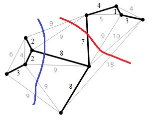

</br></br>

### Kruskal's algoritme

**Helt enkelt:** Velg til enhver tid den billigste kanten i treet som kobler sammen nye noder men som ikke skaper en
sykel.

Kruskal's algoritme finner en trygg kant for å legge til i den voksende skogen, ved å finne alle kantene med lavest vekt
som kobler sammen to trær i skogen, men som samtidig ikke lager en sykel


Kruskal's algoritme kvalifiseres som en grådig algoritme fordi ved hvert steg legger den til en kant med minst mulig
vekt i skogen. Implementeringen av _Kruskal_ 's algoritme likner algoritmen for å finne sammenhengende komponenter fra
[_traversering av grafer_](#of8):

-   Den bruker disjunkt-sett datastruktur for å vedlikeholde flere disjunkte sett med elementer. Hvert sett inneholder
    nodene til et tre i den gjeldene skogen.
-   Operasjonen _Find-Set(u)_ returnerer et element fra settet som representerer inneholdet _u_. Derfor kan vi bestemme
    om to noder _u_ og _v_ kommer fra det samme treet, ved å skjekke `FIND-SET(u) == FIND-SET(v)`.
-   For å kombinere trær, bruker _Kruskal_ 's algoritmen _Union_ prosedyren.

```pseudocode
MST-KRUSKAL(G, w)
1	 A = ∅
2	 for each vertex v ∈ G.V
3		 MAKE-SET(v)
4	 sort the edges of G.E into nondecreasing order by weight w
5	 for each edge (u,v) ∈ G.E, taken in nondecreasing order by weigth
6		 if FIND-SET(u) ≠ FIND-SET(v)
7			 A = A ∪ {(u,v)}
8			 UNION(u,v)
9	 return A
```

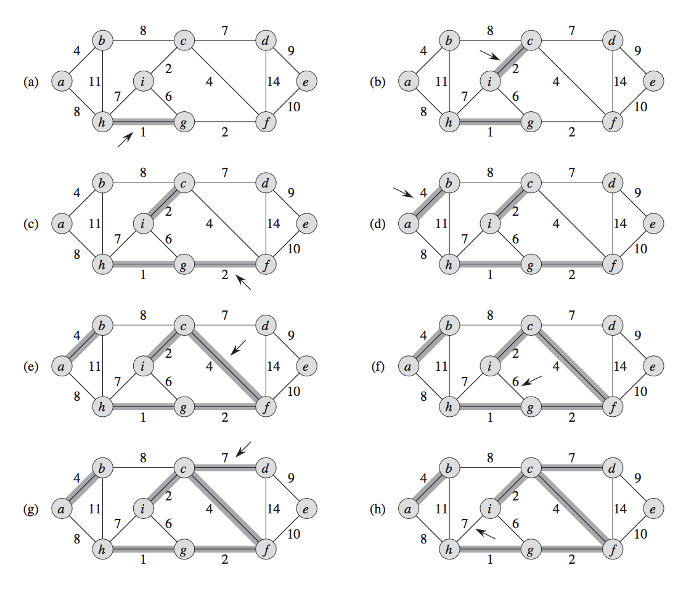

Figuren over viser hvordan _Kruskal's_ fungerer:

-   Linje 1-3 initialiserer settet _A_ til et tomt sett og lager | _V_ | trær, hvert tre med en node.
-   For-løkken på linje 5-8 ser på kanter etter vekt, fra lav til høy. For-løkken skjekker, for hver kant (_u,v_ ), om
    endepunktene _u_ og _v_ er i samme tre.
    -   Dersom de er det, kan ikke kanten (_u,v_ ) bli lagt til i skogen uten å lage en sykel, og kanten blir derfor
        forkastet.
    -   Dersom de tilhører forskjellige trær, i dette tilfellet så legges kanten (_u,v_) til _A_, og i linje 8 merges
        nodene i de to trærne.

#### Kjøretid:

Kjøretiden til Kruskal's algoritmen for en graf _G_ = (_V, E_ ), avhenger av hvordan vi har implementert den disjunkte
datastrukturen. Dersom vi antar at vi har brukt den _disjunkte-sett-skog_ implementasjonen med _union-av-rang_ og
_sti-kompresjon_ hierarki, siden det er den raskeste implementasjonen vi vet om.

<pre>
<b>Operasjon</b>          <b>Antall</b>          <b>Kjøretid</b>          
<i>Make-Set</i>           V               O(1)
<i>Sortering</i>          1               O(E lg E)
<i>Find-Set</i>           O(E)            O(α(V))
<i>Union</i>              O(E)            O(α(V))
</pre>

Det gir at kjøretiden totalt er: **O(_E_ lg _V_)**

</br>

### Prim's algoritme

**Helt enkelt:** Begynn i tilfeldig node. Velg den billigste kanten ut fra den noden som kobler inn en ny node.

Prim's algoritme opererer ganske så likt som Dijkstra's algoritme for å finne korteste vei i en graf. Prim's algoritme
har den egenskapen at kantene i settet _A_ alltid former et enkelt tre.

Treet starter med en vilkårlig rot node _r_ og vokser til treet spenner alle nodene i _V_. Hvert steg legger til en lett
kant til treet _A_, som kobler _A_ til en isolert node - en som ingen andre kanter i _A_ går til. Denne regelen gjør at
kun trygge kanter legges til i _A_, og derfor når algoritmen terminerer vil kantene i _A_ forme et minimalt spenntre.


Man kan også tenke på det som at det blå området former et snitt rundt det allerede eksisterende spenntreet, og at
algoritmen velger den kanten med lavest vekt som krysser snittet, og legger denne til i spenntreet som nevnt i -
[hvordan identifisere en trygg kant](#trygg_kant).

Denne strategien kvalifiseres som grådig siden det til treet legges til en kant, som bidrar minst mulig til den totale
vekten til treet.

Under kjøringen av algoritmen vil alle nodene som ikke er i treet enda, ligge i en min-prioritets kø _Q_ basert på _key_
attributten. For hver node _v_, er _v.key_ den minste vekten for enhver kant som kobler _v_ til en node i treet.

```pseudocode
MST-PRIM(G, w, r)
1	 for each u  G.V
2		 u.key = ∞
3		 u.π = NIL
4	 r.key = 0
5	 Q = G.V
6	 while Q ≠ ∅
7		 u = EXTRACT-MIN(Q)
8		 for each v ∈ G.Adj[u]
9			 if v ∈ Q and w(u,v) < v.key
10				 v.π = u
11				 v.key = w(u,v)
```

-   Linje 1-5 setter _key_ til hver node til ∞, unntat roten, samt hver forelder til å være NIL. Den initialiserer også
    min-prioritetskøen _Q_ som inneholder _nodene_.

**Illustrasjon av algortimen:**

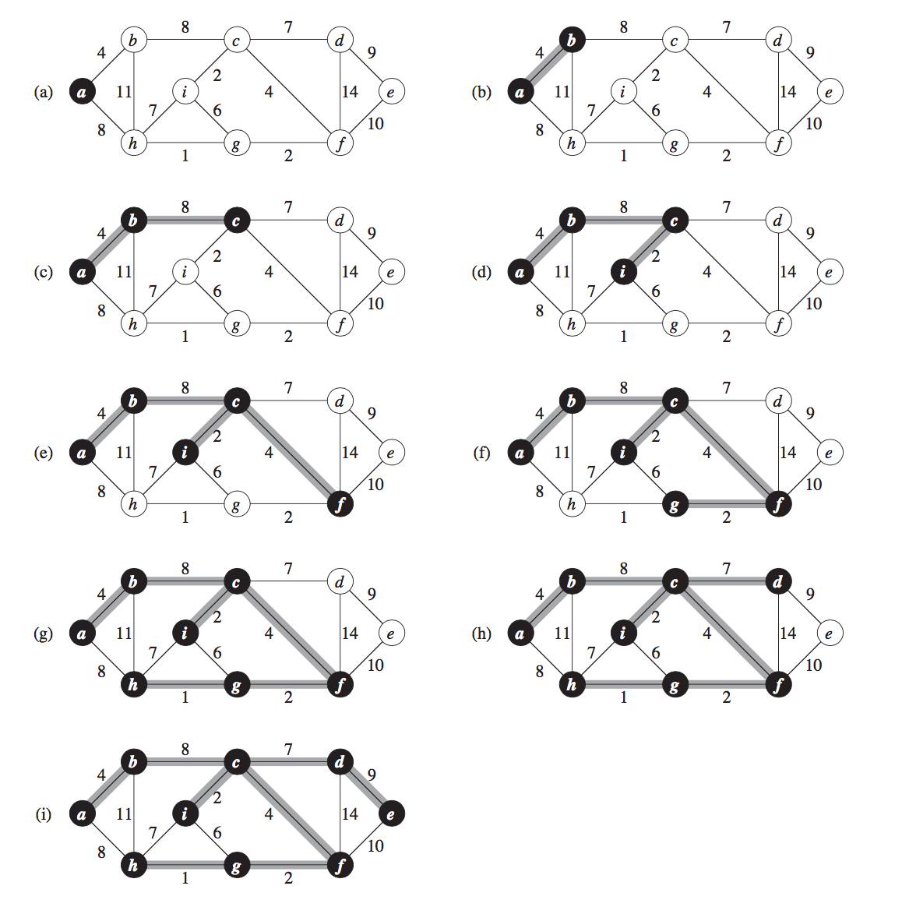

#### Kjøretiden

Kjøretiden til _Prim's algoritme_ avhenger av hvordan vi har implementert min-prioritetskøen _Q_. Dersom vi
implementerer _Q_ som en binær min-heap, kan vi bruke _Build-Min-Heap_ prosedyren for å gjøre linje 1-5 i O(_V_ ) tid.

Kroppen til **while**-løkken kjøres | _V_ | ganger, og siden hver _Extract-Min_ operasjon tar O(lg _V_ ) tid, blir den
totale tiden for alle kall av _Extract-Min_ O(_V_ lg _V_ ).

**For**-løkken på linje 8-11 kjøres O(_E_ ) ganger til sammen, og summen av lengden på alle nabolistene blir 2| _E_ |.

Endring av attributt på linje 11 involverer implisitt _Decrease-Key_ operasjonen på min-heapen, som en binær min-heap
bruker O(lg _V_ ) tid på.

Til sammen blir derfor den **totale kjøretiden** for _Prim's algoritme_:

-   O(_V_ lg _V_ + _E_ lg _V_ ) = **O(_E_ lg _V_)**

> Dersom vi hadde brukt en Fibonacci heap, ville vi kunne forbedret _Prim's algoritme_ til å kjøre på **O(_E_ + _V_ lg
> _V_ )** tid.

</br></br></br>

## Korteste vei fra én til alle <a name="of10"></a>

I et **korteste vei problem** blir vi gitt en vektet, rettet graf _G = (V, E)_, med en vektfunskjon _w_ : _E_ → ℝ som
mapper vektene til et sett kanter. Vekten **_w(p)_** av veien _p_ = ⟨ _v_<sub>0</sub>,
_v_<sub>1</sub>,...,_v_<sub>_k_</sub> ⟩ er summen av $w(p) = \sum w (v_{i-1},v_i)$ vektene til kantene på veien:

Vi definerer den korteste-vei vekten δ(_u_,_v_ ) fra _u_ til _v_ med:

$\displaystyle w(p) = \sum^k_{i=1} w (v_{i-1}, v_i)$

#### Varianter:

I denne forelesningen er fokuset på **single-source shortest-paths problem**: Gitt en graf _G = (V, E)_, ønsker vi å
finne en korteste vei fra en gitt **kilde** (_eng. source_) node _s_ &in; _V_ for hver node _v_ &in; _V_. Algoritmen for
single-source problemet kan løse mange andre problemer, som f.eks. disse variantene:

**Single-destination shortest-paths problem:** Finn en korteste vei til en gitt _destinasjon_ node _t_ fra alle andre
noder. Ved å reversere retingen til hver kant i grafen, kan vi redusere dette problemet til et _singe-source problem_

**Single-pair shortest-path problem:** Finn en korteste vei fra _u_ til _v_ for gitte noder _u_ og _v_. Dersom vi løser
_single-source problemet_ med kilde-node _u_, løser vi dette problemet også. Alle kjente algoritmer for dette problemet
har samme _worst-case_ kjøretid som den beste single-source algoritmen.

**All-paris shortest-paths problem:** _(Alle til alle)_ Finn en korteste vei fra _u_ til _v_ for hvert eneste par av
noder _u_ og _v_. Vi kan løse dette problemet ved å kjøre en _single-source_ algoritme en gang fra hver node, men vi kan
i mange tilfeller løse den raskere. Mer om dette i neste seksjon.

</br>

#### Optimal substruktur til en korteste vei

Korteste-vei algoritmer avhenger typisk av egenskapen om at en korteste vei mellom to noder inneholder andre korteste
veier innad. **Merk** at optimal substruktur er en av **nøkkelindikatorene** på at dynamisk programmering og den grådige
metoden muligens tar sted. _Djikstra's algoritme_, som vi snart kommer til, er en grådig algoritme

</br>

#### Negative kanter

Noen instanser til single-source shortest-path problemet kan inkludere negative kanter. Dersom grafen _G_ inneholder en
negativ sykel, som kan nås fra _s_, er ikke lenger den korteste veien δ(_u_,_v_) definert (kan være definert som -∞).
Ingen vei fra _s_ til en node i sykelen kan være korteste vei, og ingen sti bli _kortest_.

#### Sykler

Som vi har sett kan den ikke innholde en negativ sykel. Den korteste veien kan heller ikke inneholde en positiv sykel,
da om man hadde fjernet sykelen ville man fått en **enda kortere vei** med samme kilde _s_ og destinasjon _t_. Dersom vi
har en sykel med vekt 0, vil det fortsatt finnes en korteste-vei uten denne sykelen. Derfor sier vi at når vi finner
korteste vei, har de ingen sykler, de er **enkle** veier.

> Siden enhver asyklisk graf _G = (V, E)_ har maks | _V_ | distinkte noder, har den også på det meste | _V_ | - 1
> kanter. Derfor kan vi kun se på korteste veier med maksimalt | _V_ | - 1 kanter.

</br>

#### Representere korteste veier

Vi representerer korteste veier noe likt som vi representerte bredde-først trær. Gitt en graf _G = (V, E)_ har vi for
hver node _v_ &in; _V_ en forgjenger _v.&pi;_ som enten er en annen node eller NIL. Korteste-vei algoritmene i dette
kapittelet _(Kap. 25)_ setter &pi; attributten slik at kjeden av forgjengere fra en node _v_ løper tilbake langs en
korteste vei fra _s_ til _v_. Gitt en node _v_, der _v.&pi;_ ≠ NIL, vil prosedyren _Print-Path(G,s,v)_, skrive ut
korteste vei fra node _s_ til _v_.

Et korteste-vei tre er som et bredde-først tre, men den inneholder korteste veier fra kilden _s_ definert på
kant-vekter, isteden for antall kanter. Et korteste-vei tre med rot _s_ er en rettet subgraf _G' = ( V', E' )_, hvor
_V'_ &sube; _V_ og _E'_ &sube; _E_ slik at:

1. _V'_ er settet med alle noder nåbare fra _s_ i _G_
2. _G'_ former et rotfestet tre med rot _s_, og
3. for alle noder _v_ &in; _V'_, er den unike veien fra _s_ til _v_ i _G'_ den korteste veien fra _s_ til _v_ i _G_.

</br>

### Slakking

Algoritmene vi skal se på bruker teknikken **slakking** _(eng. relaxation)_. For hver node _v_ &in; _V_, vedlikeholder
vi attributten _v.d_, som er en øvre grense på vekten til den korteste veien fra en kilde _s_ til _v_. Vi kaller _v.d_
**korteste vei estimatet**. Vi initialiserer korteste vei estimatet og forgjengerne med følgende **&theta;(V)**
prosedyre:

```pseudocode
INITIALIZE-SINGLE-SOURCE(G, s)
1	for each vertex v ∈ G.V
2		v.d = ∞
3		v.π = NIL
4	s.d = 0
```

Etter initialisering har vi v.π = NIL for alle noder _v_ &in; _V_, og s.d = 0 og v.d = ∞ for alle _v_ &in; _V_ - { _s_ }

Prosessen av å slakke en kant (_u,v_ ) består av teste om vi kan forbedre den korteste veien til _v_ som vi har, og
dersom det går oppdatere _v.d_ og _v.π_. Følgende kode utfører et slakke-steg på en kant (_u,v_ ) i **O(1)** tid:

```pseudocode
1	if v.d > u.d + w(u, v)
2		v.d = u.d + w(u, v)
3		v.π = u
```

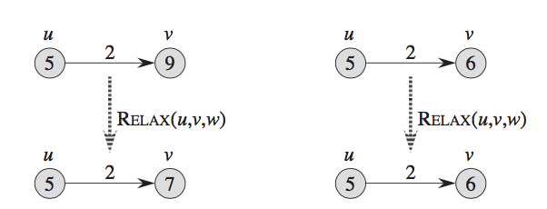

_Figuren viser ett eksempel hvor en kortere sti ble funnet, og en hvor det ikke ble det._

Algoritmene kaller først _Initialize-Singe-Source_ og slakker kantene gjentatte ganger:

-   _Djikstra's algoritme_ og _DAG-Shortest-Path_ slakker hver kant nøyaktiv én gang.
-   _Bellman-Ford_ algoritmen slakker hver kant | _V_ | - 1 ganger.

</br>

### Bellman-Ford

_Bellman-Ford_ algoritmen løser single-source korteste vei problemet på generelt basis der kantvektene **kan være
negative**. Gitt en vektet, rettet graf _G_ = (_V, E_ ) med kilde _s_ og vektfunksjon _w_ : _E_ → ℝ, returnerer
_Bellman-Ford_ algoritmen en boolean verdi som indikerer om det finnes en negativ sykel som kan nås fra _s_. Dersom det
er finnes en slik negativ sykel, betyr det at det ikke finnes noen løsning. Dersom det ikke er en negativ sykel,
produserer algoritmen en korteste vei og dens vekter.


Algoritmen slakker kanter, ved å minimere _v.d_ på kantene til en korteste vei fra _s_ til hver node _v_ &in; _V_, til
den finner den faktiske korteste-vei vekten &delta;(_s,v_ ). Algoritmen retureren True, hvis og bare hvis grafen ikke
inneholder noen negative sykler.

```pseudocode
BELLMAN-FORD(G, w, s)
1	 INITIALIZE-SINGLE-SOURCE(G, s)
2	 for i = 1 to |G.V| - 1
3		 for each edge (u,v) ∈ G.E
4			 RELAX(u,v,w)
5	 for each edge (u,v) ∈ G.E
6		 if v.d > u.d + w(u,v)
7			 return False
8	 return True
```

-   Algoritmen slakker hver kant **| V | - 1** ganger.

**Kjøretid:** Bellman-Ford algoritmen kjører på **O(_VE_ )** tid

> Siden initialiseringen tar &theta;(V) tid, og alle | _E_ | kantene slakkes | _V_ | - 1 ganger, og for-løkken på linje
> 5-7 tar O(_E_ ) tid, blir den totale kjøretiden derfor som sagt: **O(_VE_ )**.

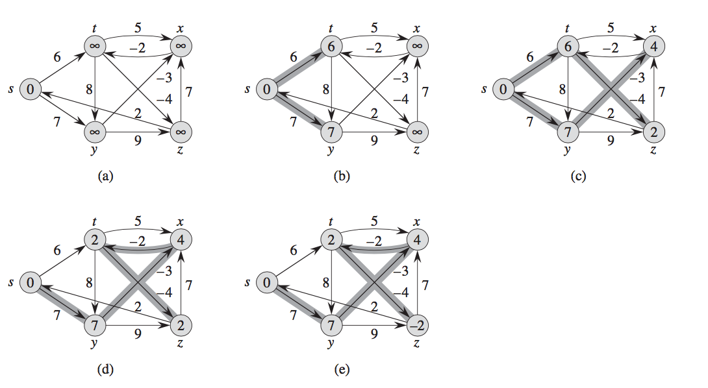

### DAG-Shortest-Path

Ved å slakke kantene til en vektet DAG _G_ = (_V, E_ ) ifølge en topologisk sortering av nodene, kan vi regne ut den
korteste veien fra en enkel kilde i **&theta;(_V + E_ )** tid. Korteste vei er godt definert i en DAG, siden det verken
finnes **negative kanter eller sykler**.

Algoritmen starter med å topologisk sortere DAG-en til en lineær ordning på nodene. Dersom DAG-en inneholder en vei fra
node _u_ til node _v_, da kommer _u_ før _v_ i den topologiske sorteringen. Vi skal bare gå over nodene en gang i den
topologiske sorterte rekkefølgen. Når vi prosesserer hver node, slakker vi hver kant som forlater noden. Slakker
utkantene til nodene fra venstre mot høyre.

```pseudocode
DAG-SHORTEST-PATH(G, w, s)
1	topological sort the vertices of G
2	INITIALIZE-SINGE-SOURCE(G,s)
3	for each vertex u taken in topological sorted order
4		for each vertex v ∈ G.Adj[u]
5			RELAX(u,v,w)
```

-   Algoritmen slakker hver kant nøyaktig èn gang.

**Kjøretiden:** Kjøretiden til algoritmen er ganske enkel å analysere. Den topologiske sorteringen i linje 1 tar
&theta;(_V + E_ ) tid. Kallet til _Initialize-Single-Source_ på linje 2 tar &theta;(_V _) tid. _For_-løkken på linjene
4-5 slakker hver kant nøyaktig en gang, og hver iterasjon av for-løkken tar O(1) tid. Derfor blir den totale kjøretiden
derfor **&theta;(_V + E_ )**

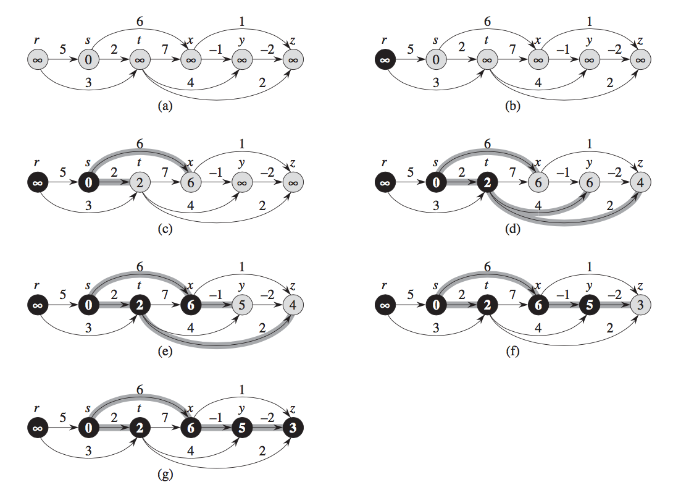

> Korteste-vei problemet har optimal delstruktur. Delproblemene er avstanden fra kildenoden til _i_ naboer, velg den som
> gir best resultat.

</br>

### Dijkstra's algoritme

_Dijkstra's algoritme_ løser single-source korteste vei problemet på en vektet, rettet graf _G_ = (_V, E_ ) der alle
kantene har positiv vekt. Det betyr at Dijkstra's algoritme **ikke** kan brukes på grafer med **negative kanter**.
Derfor antar vi videre at _w(u,v)_ ≥ 0 for hver kant _(u,v)_ &in; _E_. Som vi skal se er kjøretiden til Dijkstra's
lavere enn _Bellman-Ford_.


Dijkstra's algoritme velger gjentatte ganger den noden _u_ &in; _V - S_ med minst korteste-vei-estimat, legger til _u_ i
_S_, og slakker alle kanter **ut** fra _u_.

I følgende implementasjon, bruker vi en min-prioritetskø _Q_ av noder, basert på deres _d_ (_distance_) verdi.

```pseudocode
DIJKSTRA(G, w, s)
1	INITIALIZE-SINGLE-SOURCE(G,s)
2	S = ø33
3	Q = G.V
4	while Q ≠ ø
5		u = EXTRACT-MIN(Q)
6		S = S ∪ {u}
7		for each vertex v ∈ G.Adj[u]
8			RELAX(u,v,w)
```

> Slakker hver node én gang.

-   Dijkstra slakker alle utkantene til den noden _v_ med minst _v.d_.

**Løkkeinvariant:** _Q_ = _V - S_, har også at _v.d_ = &delta;(_s,v_ )

#### Kjøretid:

<pre>
<b>Operasjon</b>          <b>Antall</b>          <b>Kjøretid</b>          
<i>Initialisering</i>     1               Θ(V)
<i>Build-Heap</i>         1               Θ(V)
<i>Extract-Min</i>        V               O(lg V)
<i>Decrease-Key</i>       E               O(lg V)
</pre>

Som gir den totale kjøretiden på **`O(E lg V + V lg V)`**

> Dersom vi hadde benyttet oss av en Fibonacci heap, vil \*Extract-Min være O(1) og den totale kjøretiden blir da
> `O(V lg V + E)`

</br></br></br>

## Korteste vei fra alle til alle <a name="of11"></a>

Nå skal vi se på problemet om å finne en korteste vei fra alle par av noder i en graf _(korteste vei fra alle til
alle)_. Som i korteste vei fra en til alle problemet blir vi gitt en vektet, rettet graf _G_ = (_V, E_ ), og en
vektfunksjon _w_. Vi ønsker å finne korteste vei mellom alle par _u,v_ &in; _V_.

Vi kan løse alle korteste vei fra alle til alle problemer ved å kjøre en single-source korteste vei algoritme | _V_ |
ganger, en gang for hver node som kilden.

-   Dersom alle kantvektene er positive, kan vi bruke Dijkstra's algoritme:
    -   Med linær-liste som min-prioritetskø blir kjøretiden: O(_V<sup> 3</sup>_ )
    -   Med binær heap som min-prioritetskø blir kjøretiden: O(_VE lg V_ )
    -   Med Fibonacci heap som min-prioritetskø blir kjøretiden: O(_V_<sup> 2</sup> lg _V_ + _VE_ )
-   Dersom grafen har negative kanter kan vi bruke den tregere algoritmen, Bellman-Ford:
    -   Den resulterende kjøretiden blir O(_V_<sup> 2</sup> _E_ )
    -   På en tett graf der E ≈ V<sup> 2</sup> vil kjøretiden bli på hele O(_V_<sup> 4</sup>)

På dette problemet ser vi på nabomatriser, i stedet for nabolister som vi tidligere har jobbet med. Vi antar at nodene
er nummerert 1,2,...,| _V_ |, slik at input er en _n_ x _n_ matrise W som representerer kantvektene til en rettet graf
_G_ med _n_ noder.

-   Vi tillater negative kanter, men vi antar at input-grafen ikke har noen negative sykler.

For å løse kortestevei fra alle til alle problemet på en nabomatrise, må vi ikke bare regne ut korteste vei vektene men
også en forgjenger matrise &Pi; = (&pi;<sub>_ij_</sub>), hvor &pi;<sub>_ij_</sub> = NIL dersom _i_ = _j_, eller dersom
det ikke er en vei fra _i_ til _j_, ellers er &pi;<sub>_ij_</sub> forgjengeren til _j_ på en koreste vei fra _i_.

For å printe ut den korteste veien fra en node _i_ til _j_, kan vi brue følgende prosedyre:

<pre>
PRINT-ALL-PAIRS-SHORTEST-PATH(Π, i, j)
1	if i == j
2		print i
3	elif Π(i,j) == NIL
4		print "no path from " i " to " j "exists" 
5	else PRINT-ALL-PAIRS-PATH(Π, i, π<sub>ij</sup>)
6		print j
</pre>

### Floyd-Warshall <a name="floyd"></a>

Nå skal vi se på en dynamisk programmerings algoritme for korteste vei fra alle til alle problemetet på en rettet graf
_G_.

Algoritmen ser på mellomliggende noder av en korteste vei, hvor mellomliggende _p_ er enhver node i _G_ unntatt
_v_<sub>1</sub> og _v_<sub>_2_</sub>.

Vi skriver Floyd-Warhall algoritmen som en rekursiv bottom up algoritme. Vi definerer _d_<sub>_ij_</sub><sup>(_k_
)</sup> rekursivt som:

$d_{ij}^{(k)} = \begin{cases}
     & w_{ij} & \text{if } k = 0 \\
     & min(d_{ij}^{(k-1)}, d_{ik}^{(k-1)} + d_{kj}^{(k-1)}) & \text{if } k\geq 1 \\
\end{cases}$

, og matrisen $D^{(n)} = d_{ij}^{(n)}$ gir det siste svaret $d_{ij}^{(n)} = \delta(i,j)$ for alle $i,j \in V$.

<pre>
FLOYD-WARSHALL(W)
1 n = W.rows
2 D<sup>(0)</sup> = W
3 for k = 1 to n
4   let D<sup>(k)</sup> = (d<sub>ij</sub><sup>(k)</sup>) be a new n x n matrix
5   for i = 1 to n
6       for j = 1 to n
7           d<sub>ij</sub><sup>(k)</sup> = min(d<sub>ij</sub><sup>(k - 1)</sup>, d<sub>ik</sub><sup>(k - 1)</sup> + d<sub>kj</sub><sup>(k - 1)</sup>)
8 return D<sup>(n)</sup>
</pre>

> Kjøretiden er bestemt av de tre nestede _for_-løkkene på linje 3-7. Siden hver utførerelse av linje 7 tar O(1) tid,
> kjører algoritmen på Θ(_n_<sup> 3</sup>) = Θ(_V_<sup> 3</sup>).

-   Det er | _V_ | noder vi skal gå igjennom, og for hver node kan man variere startnoden med | _V_ - 1 | muligheter, og
    sluttnoden | _V_ - 2 | muligheter.
-   _Floyd-Warshall_ kjører på &theta;(_V_<sup> 3</sup> ) tid.
-   Dijkstra bruker også O(_V_<sup> 3</sup> ) på alle-til-alle, men operasjonene per ledd i Floyd-Warshall er så mye
    mindre at denne vil lønne seg.
    -   Dersom det er relativt få kanter i forhold til noder, vil derimot Dijkstra med en heap fremdels være bedre.

**Illustrasjon av Floyd-Warshall:**

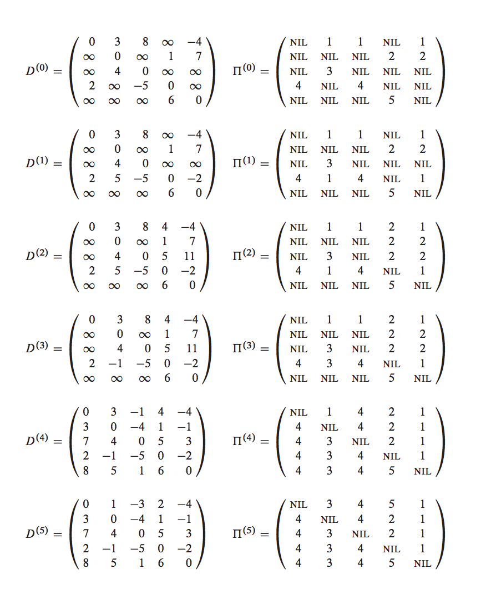

</br></br>

### Transitive Closure

Gitt en rettet graf _G_ = (_V, E_) med et sett noder _V_ = {1,2,..,_n_ } vil vi kanskje finne ut om _G_ inneholder en
vei fra _i_ til _j_ for alle par _i, j_ &in; _V_. Derfor definerer vi **transitiv closure** til _G_ som grafen
<i>_G_<sup> &#10040;</sup></i> = (_V_, <i>_E_<sup> &#10040;</sup></i>), hvor <i>_E_<sup> &#10040;</sup></i> = {(_i, j_ )
: there is a path from _i_ to _j_ in _G_ }

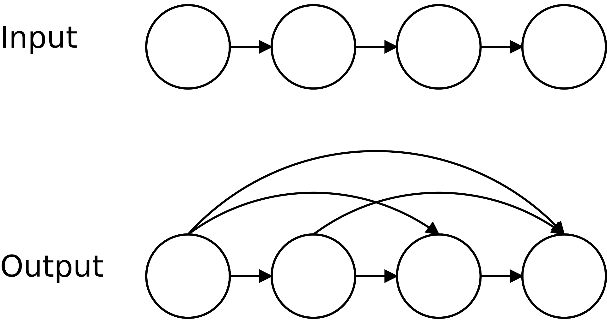

_Illustrerasjon av hva transitive closure gjør_

Vi kan kjøre denne type algoritme på &theta;(_n_<sup> 3</sup>), og kan endre alle kantvektene til 1 og bruke
_Floyd-Warshall_. , eller bruke operasjoner &or;, &and; for å regne ut om det finnes en vei.

<pre>
1   n = |G.V|
2   let T<sup> (0)</sup> = (t<sub>ij</sub><sup> (0)</sup>) be a new n x n matrix
3   for i = 1 to n
4       for j = 1 to n
5           if i == j or (i, j) ∈ G.E
6               t<sub>ij</sub><sup> (0)</sup> = 1
7           else
8               t<sub>ij</sub><sup> (0)</sup> = 0
9   for k = 1 to n
10      let T<sup> (k)> = (t<sub>ij</sub><sup> (k)</sup>) be a new n x n matrix
11      for i = 1 to n 
12          for j = 1 to n 
13              t<sub>ij</sub><sup> (k)</sup> = t<sub>ij</sub><sup> (k - 1)</sup> ∨ ( t<sub>ik</sub><sup> (k - 1)</sup> ∧ t<sub>kj</sub><sup> (k - 1)</sup>)
14  return T<sup> (n)</sup>
</pre>

</br></br></br>

## Maksimal flyt <a name="of12"></a>

Vi kan se på en rettet graf som et "flytnettverk" og bruke det til å svare på spørsmål om materiell flyt. Se for deg en
materie (f.eks. sjokolade) som flyter igjennom et system, fra en kilde _s_, hvor materien blir produsert, til et sluk
_t_, hvor det konsumeres. Vi kan se på hver kant i flytnettverket som et rør med en viss kapasitet, og vi ønsker å oppnå
maksimal flyt til sluket.

I maksimal flyt problemet ønsker vi å finne ut den største mengden vi kan frakte fra kilden til sluket uten å bryte noen
av kapasitetene i flytnettverket.

#### Flytnettverk

-   Et flytnettverk `G = (V, E)` er en rettet graf.
-   Hver kant har en **kapasitet** _c(u,v)_ ≥ 0.
-   Vi krever også at dersom det finnes en kant _(u,v)_, finnes det ikke noen kant _(v,u)_ i den motsatte retningen.
-   Dersom _(u,v)_ &notin; _E_, da definerer vi _c(u,v)_ = 0.
-   Grafen er sammenhengende og har ikke selv-løkker
-   Vi har en **kilde** _s_ og et **sluk** _t_ &in; _V_.
-   Vi antar at hver node ligger på en vei fra kilden til sluket.
    -   Dvs. at for hver node _v_ &in; _V_, inneholder flytnettverket en vei _s_ &rarrw; _v_ &rarrw; _t_.

#### Flyt

En flyt i et flytnettverk _G_ er en funksjon _f_ : _V_ x _V_ &rarr; ℝ, som har følgende egenskaper:

-   **Kapasitetsbegrensning:** For alle _u,v_ &in; _V_, krever vi at 0 ≤ _f(u,v)_ ≤ _c(u,v)_
-   **Flytbeholdning:** For alle _u_ &in; _V_ - _{ s,t }_, krever vi at `∑ f(u,v) = ∑ f(v,u)`.
    -   Flyt inn = Flyt ut

Vi kaller mengden _f(u,v)_ for flyten fra node _u_ til _v_.

**Flytverdien** er definert ved `|f| = ∑ f(s,v) - ∑ f(v,s)` , som den totale flyten ut av kilden, minus flyten inn i
kilden.

#### Antiparallelle kanter

La oss anta at man allerede i flytnetterverket har en kant _(v<sub>1</sub>,v<sub>2</sub>)_ &in; _E_, også får man et
tilbud om en til kant _(v<sub>2</sub>, v<sub>1</sub>)_. Da strider dette imot det vi antok over, det at dersom _(u,v)_
&in; _E_, så _(v,u)_ &notin; _E_.

Vi kaller to kanter _( v<sub>1</sub>, v<sub>2</sub> )_ og _( v<sub>2</sub>, v<sub>1</sub> )_ **antiparallelle kanter**.
Dette løser vi ved å:

1. Velge en av de to antiparalelle kantene, f.eks. _( v<sub>1</sub>, v<sub>2</sub> )_.
2. Splitter den, ved å legge til en ny node _v'_
3. Erstatte _( v<sub>1</sub>, v<sub>2</sub> )_ med et par av kanter _( v<sub>1</sub>, v' )_ og _( v', v<sub>2</sub> )_.
4. Begge kantene med kapasitet som den originale kanten.

**Illustrasjon:**

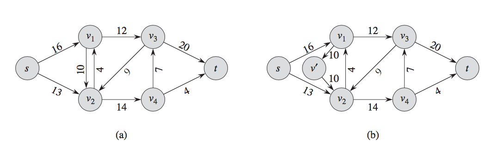

</br></br>

#### Nettverk med flere kilder og sluk

Et maksimal flyt problem kan har flere kilder og sluk, istedet for en av hver. Dersom man har et sett med _kilder_ {
_s_<sub>1</sub>, _s_<sub>2</sub>,..., _s_<sub>_m_</sub> } og et sett _sluker_ { _t_<sub>1</sub>, _t_<sub>2</sub>,...,
_t_<sub>_n_</sub> }.

Vi kan redusere dette problemet til et vanlig maksimal flyt problem. Vi legger da til en **superkilde** _s_ og legger
til en rettet kant (_s, s<sub>i</sup>_ ) med kapasitet _c(s, s<sub>i</sup> )_ = ∞ for hver _i_ = 1,2,..,_m_. Vi legger
også til et **supersluk** _t_ og legger til en rettet kant (_t<sub>i</sub>, t_ ) med kapasitet _c(t<sub>i</sub>, t )_ =
∞ for hver i = 1,2,..,_n_

**Illustrasjon:**

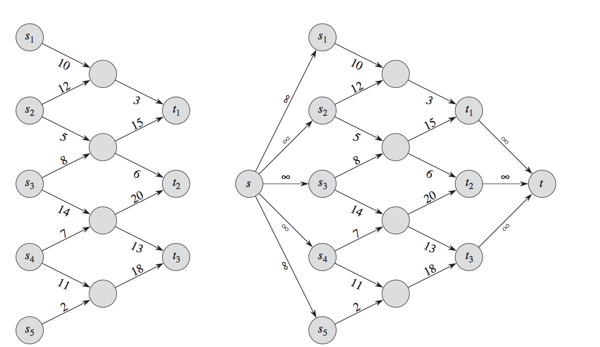

</br></br>

### Ford-Fulkerson-metoden

Vi skal nå se på Ford-Fulkerson metoden, og kaller det metode og ikke for en algortime da det finnes mange
implementasjoner med forskjellige kjøretider. Metoden avhenger av tre viktige ideer:

-   _Restnettverk_
-   _Forøkende stier_
-   _Kutt_

Ford-Fulkerson metoden øker flytverdien iterativt. Vi starter med _f(u, v)_ = 0 for alle _u, v_ &in; _V_, gitt en
initiell flyt av verdi 0. Ved hver iterasjon øker vi flytverdien i _G_ ved å finne en _forøkende sti_ i et
_restnettverk_ _G<sub> f</sub>_. Når vi vet kantene til en forøkende sti, kan vi lett øke flyten slik at vi øker
flytverdien. Vi øker flytverdien med kapasiteten til den laveste kanten i den forøkende stien vi fant.

Vi øker flyten helt til restnettverket ikke har flere forøkende stier.

<pre>
FORD-FULKERSON-METHOD(G, s, t)
1	initialize flow <i>f</i> to 0
2	while there exists an augmenting path <i>p</i> in the residual network G<sub>f</sub>
3		augment flow <i>f</i> along <i>p</i> 
4	return <i>f</i> 
</pre>

#### Restnettverk

Intuitivt, gitt et flytnettverk _G_ og en flyt _f_, består restnettverket _G<sub>f</sub>_ av kanter med kapasiteter som
representerer hvor mye vi kan endre flyten på kantene i G.

En kant i flytnettverken kan ta imot enda større flyt, lik kantens kapasitet minus flyten i kanten. Dersom denne verdien
er positiv kan vi putte kanten i _G<sub>f</sub>_ med en restkapasitet på _c<sub>f</sub> (u, v )_ = _c(u, v )_ - _f ( u,v
)_. De eneste kantene i _G_ som er i _G<sub>f</sub>_ er de som kan ta imot mer flyt.

> De kantene som _(u, v )_ som har like stor flyt som kapasitet har restkapasitet _c<sub>f</sub> (u, v )_ = 0, er ikke i
> _G<sub>f</sub>_.

Restnettverket innholder kanskje kanter som ikke er i _G_. For å representere en mulig minskning av positiv flyt _f (u,
v )_ på en kant i _G_, putter vi inn en kant _(v, u )_ i restnettverket med restkapasitet _c<sub>f</sub_ - det betyr at
man kan sende flyt tilbake i kanten, dvs å **oppheve** (_eng. cancel_ ) flyten i kanten _(u, v )_.

-   Disse reverserte kantene i restnettverket lar algoritmen sende tilbake flyt som den allere har sent langs kanten.
    Det er ekvivalent med å senke flyten på kanten.

-   Å sende flyt langs en kant, der det allerede går flyt, i et restnettverk er også kjent som **oppheving**. Det er
    dette bakoverkantene i restnettverket representerer.

-   Dersom vi har en kant _( u,v )_ med _c(u,v )_ = 16 og _f( u,v )_ = 11, kan vi øke _f(u,v )_ med _c<sub>f</sub>(u,v
    )_ = 5. Men algoritmen kan også sende tilbake 11 enheter av flyten fra _v_ til _u_ og dermed _c<sub>f</sub>(v,u )_
    = 11.

En flyt i et restnettverk gir et kart for å legge til flyt i det originale flytnettverket.

**Illustrasjon av restnettverk ut fra et flytnettverk:**

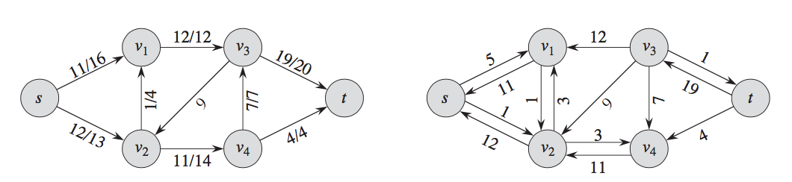

<br> </br>

#### Forøkende stier

Gitt et flytnettverk _G_ = (_V, E_ ), og en flyt _f_, en en enkel sti fra _s_ til _t_ i et restnettverk _G<sub> f
</sub>_ en **forøkende sti** (_eng. augmenting path_ ).

-   Langs fremoverkanter: _Flyten kan økes_
-   Langs bakoverkanter: _Flyten kan omdirigeres_
    -   Altså: En sti der den totale flyten kan økes med opptil _c<sub>f</sub>_ (_u, v_ ) uten å bryte med noen av
        kapasitetene i _G_.

Vi har at vi kan øke flyten på en kant i en forøkende sti _p_ med restkapasiteten til _p_.

<br>

### Snitt i flytnettverk

Ett **snitt** (_S, T_ ) av et flytnettverk _G_ = (_V, E_ ) er en partisjon av _V_ inn i _S_, og _T_ = _V - S_ slik at
_s_ &in; _S_ og _t_ &in; _T_.

**Her er et snitt (_S, T_ ):**

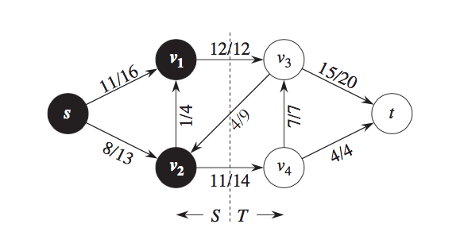

-   Nettoflyten lags kuttet blir: **f(_S, T_ )** = _f ( v<sub>1</sub>, v<sub>3</sub> )_ + _f ( v<sub>2</sub>,
    v<sub>4</sub> )_ - _f ( v<sub>3</sub>, v<sub>2</sub> )_ = 12 + 11 - 4 = **19**

-   Kapasiteten blir da: **c(_S, T_ )** = _c ( v<sub>1</sub>, v<sub>3</sub> )_ + _c ( v<sub>2</sub>, v<sub>4</sub> )_ =
    12 + 14 = **26**

</br>

### Ford Fulkerson

**Normal implementasjon:**

-   Finn økende sti først
-   Finn så flaskehalsen i stien
-   Oppdater flyt langs stien med denne verdien

I hver iterasjon av _Ford-Fulkerson-metoden_, finner vi _en eller annen_ forøkende sti _p_ og bruker _p_ til å
modifisere flyten _f_. Da erstatter _f_ med _f &uarr; f<sub>p</sub>_. Der _f<sub>p</sub>_ er flaskehalsen
(_c<sub>f</sub> (p)_) til _p_. Dermed får man den nye flytverdien | _f_ | + | _f<sub>p</sub>_ |.

<pre>
FORD-FULKERSON(G, s, t)
1	<b>for</b> each edge (u,v) ∈ G.E
2		(u,v).<i>f</i> = 0
3	<b>while</b> there exists a path <i>p</i> from <i>s</i> to <i>t</i> in the residual network <i>G<sub>f</sub></i>
4		<i>c<sub>f</sub></i>(<i>p</i>) = min{<i>c<sub>f</sub></i>(u,v) : (u,v) is in <i>p</i>}
5		<b>for</b> each edge (u,v) in <i>p</i>
6			<b>if</b> (u,v) ∈ E
7				(u,v).<i>f</i> = (u,v).<i>f</i> + <i>c<sub>f</sub></i>(<i>p</i>)
8			<b>else</b>
9				(v,u).<i>f</i> = (v,u).<i>f</i> - <i>c<sub>f</sub></i>(<i>p</i>)
</pre>

-   Linje 1-2 initialiserer flyten _f_ til 0.
-   Linje 3-9 kjører en **while**-løkke som gjentatte ganger finner en forøkende sti _p_ i _G<sub>f</sub>_ og øker
    flyten _f_ langs _p_ med restkapasiteten _c<sub>f</sub>(p)_. Hver restkant i stien _p_ er enten en kant i det
    orignale nettverket eller en motsatt kant.
-   Linje 6-9 oppdaterer flyten til hvert tilfelle:
    -   Legge til flyt når restkanten er en original kant eller trekke fra dersom ikke.

**Kjøretid:**

-   Dersom vi sier at _f_ \* gir oss den maksimale flyten som vi kan oppnå.
-   Da vil vi på det meste kjøre **while**-løkken for å finne en forøkende sta, | _f_ * | ganger, da flyten *f\* må øke
    med minst en enhet av gangen.
-   Hver iterasjon av **while**-løllen tar O(_E_ ) tid, samme gjør initialiseringen på linje 1-2.
-   Dermed blir den totale kjøretiden på _Ford-Fulkerson-algoritmen_ **`O(E |f*|)`**.

**Illustrasjon av algoritmen:**

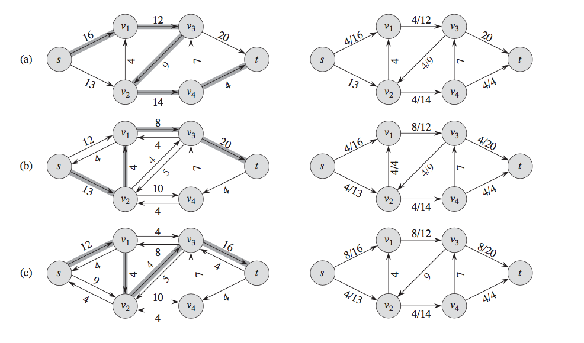

</br></br>

### Edmonds-Karp

Vi kan forbedre grensen på _Ford-Fulkerson_ ved å finne en forøkende sti _p_ i linje 3 med **bredde-først søk**. Det vil
si at vi velger en forøkende sti som den korteste veien fra _s_ til _t_, hvor hver kant har en enhet-vekt. Denne
algoritmen kaller vi for **Edmonds-Karp algoritmen**. Algoritmen kjører på O( VE<sup>2</sup> )tid, som vi skal se på
under.

Korteste-vei algoritmer avhenger typisk av egenskapen om at en korteste vei mellom to noder inneholder andre korteste
veier innad. Det gjør også Edmonds Karp.

**Mulig økning**(_augmentation_): `v.a`

<pre>
EDMONDS-KARP(G,s,t)
1	 <b>for</b> each edge (u, v) ∈ G.E
2		 (u, v).<i>f</i> = 0
3	 <b>repeat</b> > <b>until</b> t.<i>a</i> == 0
4		 <b>for</b> each vertex u ∈ G.V
5			 u.<i>a</i> = 0    //Reaching u in G_f
6			 u.π = NIL
7		 s.a = ∞
8		 Q = ∅ 
9		 ENQUEUE(Q, s)
10		 <b>while</b> t.<i>a</i> == 0 and Q ≠ ∅ 
11		 	 u = DEQUEUE(Q)
12			 <b>for</b> all edges (u, v), (v, u) ∈ G.E
13			 	 <b>if</b> (u, v) ∈  G.E
14					 c<sub>f</sub>(u, v) = c(u, v) - (u, v).<i>f</i>
15				 <b>else</b> c<sub>f</sub>(u, v) = (v, u).<i>f</i>
16				 <b>if</b> c<sub>f</sub>(u, v) > 0 and v.<i>a</i> == 0
17					 v.<i>a</i> = min(u.a, c<sub>f</sub>(u, v))
18					 v.π = u
19					 ENQUEUE(Q, v) 
20		 u, v = t.π, t    // Nå er t.<i>f</i> = c<sub>f</sub>(p)
21		 <b>while</b> u ≠ NIL
22			 <b>if</b> (u, v) ∈ G.E
23				 (u, v).<i>f</i> = (u, v).<i>f</i> + t.<i>a</i>
24			 <b>else</b>
25				 (v, u).<i>f</i> = (v, u).<i>f</i> - t.<i>a</i>
26			 u, v = u.π, u
</pre>

**Kjøretid:**

-   Operasjon: _Finn forøkende sti_

    -   Antall: O(_VE_)
    -   Kjøretid på operasjon: O(_E_)

-   **Totalt:** O(_VE<sup>2</sup>_ ) med bredde-først-søk i restnettverk

#### Hvorfor har vi O(VE) iterasjoner?

-   Avstander _synker ikke_ i residualnettverket
-   En kant (_u, v_) kan være flaskehals maks annenhver iterasjon
-   Vi velger korteste økende stier

    -   Dermed må _v_ først være 1 kant lenger unna enn _u_
    -   Så, idet (_u, v_) dukker opp igjen, må _u_ være 1 lenger unna enn _v_
    -   Når (_u, v_ ) så er kritisk igjen, har altså avstanden til _u_ økt med minst _2_

-   Dermed kan vi maks ha _O(VE)_ iterasjoner

</br>

### Maksimum bipartitt matching

Gitt en urettet graf _G_ = (_V, E_ ), er en **matching** et subsett av kanter _M_ &sube; _E_ slik at for hver node _v_
&in; _V_, har er på det meste i én kant i _M_. Det vil si at ingen kantener i _M_ deler noder.

Vi sier at en node _v_ &in; _V_ er **matchet** av matchingen _M_ dersom en node i _M_ har _v_ i seg, hvis ikke er _v_
**umatchet**. En **maksimum matching** er en matching med maksimum kardinalitet, det vil si flest mulig kanter, dvs. der
| _M_ | er maksimal.

#### Forklaring av problemet:

Vi kan se på problemet som at vi har _n_ antall nyredonorer, også har vi _m_ pasienter som venter på en nyre. Det vi
skal finne ut, er det maksimale antall med matcher, det vil si maksimale antall personer som kan få en nyre.

Vi lar da nodene i _R_ representere donorene, og _L_ representere pasientene, og kantene mellom dem representerer om
nyrene er kompatibel med pasienten.

#### Bipartite grafer

En graf der nodesettet kan partisjoneres til _V_ = _L_ &cup; _R_, hvor _L_ og _R_ er disjunkte, og alle kanter i _E_ går
mellom _L_ og _R_.

#### Finne en maksimum bipartitt matching

Vi kan bruke Ford-Fulkerson-metoden for å finne en maksimu matching på en urettet bipartitt graf _G_ = (_V, E_ ) i tid
polynomisk med | _V_ | og | _E_ |. Trikset er å konstruere et flytnettverk der flyt korresponderer med matcher, som vist
i figuren under.

Vi definerer det korresponderende flytnettverket _G'_ = (_V', E'_ ) for den bipartitte grafen som følgende:

-   Vi lar kilden _s_ og sluket _t_ være nye noder, ikke i _V_, og vi lar _V'_ = _V_ &cup; { _s_, _t_ }.
-   De rettede kantene i _G'_ er kantene i _E_, rettet fra _L_ til _R_, sammen med | _V_ | nye kanter fra kilden til _L_
    og _R_ til _t_.

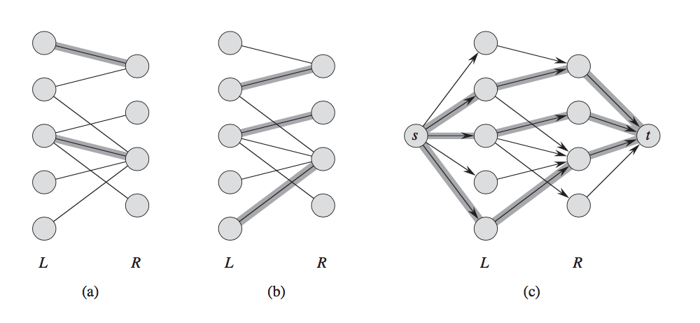

Maksimal matching i en bipartitt graf _G_ korresponderer til en maksimal flyt i det korresponderende flytnettverket
_G'_, og at vi dermed kan finne maksimum matching ved å kjøre en maksimal flyt-algoritme på _G'_.

Problemet er at maksimal flyt-algoritmen kan returnere desimaler, selvom flyt-verdien | _f_ | må være et heltall.
Følgende teorem viser at vi kan bruke Ford-Fulkerson for å løse dette problemet.

### Heltallsteoremet

Dersom kapasitetsfunksjonen _c_ kun tar på seg heltallsverdier, da vil maksimumflyten _f_ produsert av
_Ford-Fulkerson-metoden_ ha den egenskapen at | _f_ | er en heltall.

Generelt, vil flyten mellom to noder _f(u,v)_ være et heltall for alle noder _u_ og _v_.

</br></br></br>

## NP-kompletthet <a name="of13"></a>

Nesten alle algoritmene vi har sett på hittil har vært **polynomisk-tid algoritmer**: med input på størrelse _n_, og som
har worst-case kjøretid på O(_n_<sup>_k_</sup> ). Slik er det nemlig ikke med alle problemer. Vi ser gjerne på
problemersom kan løses i polynomisk-tid algoritmer som lette, og problemer som krever _superpolynomisk-tid_ som
vanskelige.

Vi skal nå se på en klasse problemer kalt de _NP-komplette_ problemer. Ingen polynomisk-tid algoritme er funnet for å
løse NP-komplette problemer, ingen har heller klart å bevise at det heller ikke finnes noen. Dette er det såkalte **N
≠ NP** spørsmålet, som er et av de store spørsmålene i datateknikk.

Flere NP-komplette problemer ligner gjerne på overflaten på problemer som vi vet vi kan løse i polynomisk tid. I hvert
av de følgende parene av problemer, er det ene løsbart i polynomisk tid, og det andre er NP-komplett:

-   **Shortest vs. longest simple path:** Vi kan finne single-source shortest path i en rettet graf _G_ = (_V, E_ ) i
    O(_VE_ ) tid. For å finne koreste enkle vei ellom to noder er vanskelig. Men det å bestemme om en graf inneholder en
    enkel vei med minst et gitt antall kanter er NP-komplett.

-   **Euler sti vs. Hamilton sykel:** En _Euler sti_ til en sammenhengende rettet graf _G_, er en sykel som traverserer
    gjennom hver kant i G minst en gang, men vi kan besøke en node mer enn en gang. En _Hamilton sykel_ til en rettet
    graf _G_ er en enkel sykel som inneholder hver node i _V_. Å avgjøre om en rette graf innholder en hamilton sykel er
    NP-komplett.

</br>

#### NP-kompletthet og klassene P og NP


Gjennom det siste av pensum skal vi referere til tre klasser av problemer: **P**, **NP** og **NPC** (NP-komplett).

-   Klassen **P** inneholder problemene som kan løses i polynomisk tid, altså i O(_n<sup>k</sup>_ ) for en konstant _k_,
    og inputstørrelse _n_

-   Klassen **NP** består av problemer som kan _verifiseres_ i polynomisk tid. Hva mener vi med at den kan verifiseres?
    Dersom vi hadde blitt gitt et **vitne** på en løsning, da kan vi bekrefte at _vitne_ er korrekt i polynomisk tid.
    Klassen **co-NP** består av problemer som kan falsifiseres i polynomisk tid.
    -   For eksempel i Hamilton sykel problemet, gitt en rettet graf _G_, ville _vitnet_ vært en sekvens
        ⟨_v<sub>1</sub>_, _v<sub>2</sub>_,...,_v<sub><sub>|V|</sub></sub>_ ⟩ av |_V_ | noder. Vi kan da lett skjekke i
        polynomisk tid at (_v<sub>i</sub>_, _v<sub>i + 1</sub>_) &in; _E_ for i = 1,2,.., |_V_ | - 1, og at
        (_v<sub><sub>|V|</sub></sub>_ , _v<sub>1</sub>_) &in; _E_ også.

Ethvert problem i P er også i NP, siden dersom et problem er i P kan vi løse det i polynomisk tid, selv uten å bli gitt
et vitne. Derfor tror vi for nå at **P** &sube; **NP**.

-   Klassen **NPC** består av problemer som referer til som NP-komplette - det vil si at de er i NP og at er så
    "vanskelige" som ethvert problem i NP.
    -   Dersom _et_ eneste NP-komplett problem kan bli løst i polynomisk tid, har _alle_ problemer i NP polynomisk-tid
        algoritme.

#### Hvordan vise at et problem er NP-komplett:

Når vi skal vise at et problem er NP-komplett, gjør vi en uttalelse om hvor vanskelig det er (eller i det minste hvor
vanskelig vi tenker det er), istedet for å si hvor lett det er. Vi prøver ikke å vise eksistensen av en effektiv
algoritme, men istedet vise at det er lite sannsynelig at en slik effektiv algoritme eksisterer.

Vi er **avhengig** av tre nøkkelkomponenter for å vise at et problem er NP-komplett:

#### Beslutnings problemer vs. optimaliserings problemer:

Mange interessante problemer er _optimaliseringsproblemer_, hvor hver mulige løsning har en tilknyttet verdi, og vi
ønsker å finne en mulig løsning med den beste verdien. For eksempel korteste-vei problemet, der vi ønsker å finne en
optimal løsning - den korteste veien. NP-kompletthet gjelder ikke direkte for optimaliseringsproblemer, men
beslutningsproblemer, der svaret kun er "_ja_" eller "_nei_" (eller mer formelt "1" eller "0"). Selv om NP-komplette
problemer er begrenset til et rike beslutningsproblemer, kan vi dra nytte av det praktiske _forholdet_ mellom
optimaliseringsproblemer og beslutningsproblemer. Vi kan vanligvis _caste_ et gitt optimaliseringsproblem som et
relatert beslutningsproblem ved å legge inn en bundet verdi for å bli optimalisert. For eksempel er et
avgjørelsesproblem relatert til _Kortest-vei is Sti_: Gitt en rettet graf _G_, noder _u_ og, og et heltall _k_,
eksisterer en sti fra _u_ til bestående av maksimalt _k_ kanter? Vi kunne her løse _Sti_ ved å løse _Korteste-vei_, og
så sammenligne antall kanter i korteste vei med verdien til beslutningsproblemet _k_. Beslutningsproblemet er _lettere_,
eller ikke vanskeligere, enn optimaliseringsproblemet. Angitt på en måte som er mer relevant for NP-fullstendighet, hvis
vi kan bevise at et _beslutningsproblem_ er vanskelig, gir vi også bevis for at det relaterte _optimaliseringsproblemet_
er vanskelig.

#### Reduksjoner:

Det at vi over viser at et problem ikke er vanskeligere eller lettere enn andre, gjelder selv når begge problemene er
beslutningsproblemer. Vi tar fordel av denne ideen i nesten hvert eneste bevis av NP-kompletthet.

La oss se på et beslutningsproblem _A_, som vi ønsker å løse i polynomisk tid. Vi kaller inputen til en problem for
instansen. La det være slik at vi allerede vetr hvordan vi kan løse et annet beslutningsproblem _B_ i polynomisk tid.
Til sist, la det være slik at vi har en prosedyre som _transformerer_ enhver instans &alpha; av _A_ til en instans
&beta; i _B_, med følgende egenskaper:

-   Transformasjonen tar polynomisk tid.
-   Svarene er det samme. Det vil si at svaret for &alpha; er _"ja"_ hvis og bare hvis svaret for &beta; også er _"ja"_.

Vi kaller en slik prosedyre i polynomisk tid en **reduksjonsalgoritme** og det gir oss en måte å løse problem _A_ i
polynomisk tid:


1. Git en instans &alpha; av problem _A_, buruker vi en polynomisk reduksjonsalgoritme som transformerer den til en
   instans &beta; av problem _B_.
2. Kjør beslutningsalgoritmen for B, i polynomisk tid, på instansen &beta;.
3. Bruk svaret for &beta; som svar for &alpha;

> Vi transformerer input fra ett problem til et annet.


Vi kan utifra dette trekke to logiske konklusjoner og et par betraktninger:

1. Hvis vi kan løse _B_, så kan vi løse _A_
2. Hvis vi _ikke_ kan løse _A_, så kan vi _ikke_ løse _B_
3. Hvis vi _ikke_ kan løse _B_, så sier det _ingenting_ om _A_
4. Hvis vi _kan_ løse _A_, sier det _ingenting_ om _A_

La oss tenke oss at vi allerede er kjent med et problem _X_, og så støter på et nytt og ukjent problem _Y_, så har vi to
scenarier der vi kan gjøre noe fornuften. Vi må gi _Y_ rollen som _A_ eller _B_:

-   Hvis vi vil vise at _Y_ _ikke er vanskeligere enn X_, så kan vi la _Y_ innta rollen som _A_, og prøve å finne en
    reduksjon fra _Y_ til _X_. Dette gjør vi ofte når vi prøver å bruke eksisterende algoritmer for et problem _X_ til å
    løse et nytt problem _Y_ &rarr; Vi reduserer _Y_ til _X_, og løser så _X_.

-   Men av og til mistenker vi at et problem vi støter på er vanskelig. Kanskje vi kjenner til et problem _X_, som vi
    _vet_ er vanskelig, og vi vil vise at _Y_ er _minst like vanskelig_. Da må vi i stedet la _Y_ innta rollen som _B_,
    og redusere fra det vanskelige problemet. Vi skriver _A_ ≤ _B_ for å uttrykke at problemet _A_ kan _løses ved hjelp
    av_ _B_.
    -   Det betyr at _A_ ikke er vanskeligere _B_, siden vi skal redusere til _B_.

#### Abstrakte problemer

Vi definerer et **abstrakt problem** _Q_ til å være en binær relasjon på et sett _I_ av probleminstanser, og et sett _S_
av problemløsninger.

Vi kan se på en abstrakt beslutningsproblem som en funksjon som mapper et sett av instanser _I_ til et løsningssett
{0,1}.

Dersom settet _I_ skulle blitt kodet til binære strenger hadde vi kalt det et _konkret problem_, som vi skal se mer på
under.

### Koding av en instans

En **koding** (_eng. encoding_ ) av et sett _S_ av abstrakte objekter er en mapping _e_ fra _S_ til et sett med binære
strenger.

For at et dataprogram skal klare å løse et abstrakt problem, må vi representere probleminstansene på en måte som
programmet skjønner. For eksempel er vi kjente med de naturlige tallene ℕ = {0,1,2,3,...} som strengene
{0,1,10,11,100,...}. Ved å bruke denne kodingen _e_ (17) = 10001.

Vi kaller et problem der settet _S_ med instanser er et set av binære strenger for et **konkret problem**. Vi sier at en
algoritme som _løser_ et konkret problem i O(_T(n)_ ) tid, dersom den gitt en probleminstans _i_ med lengde _n_ = | *i*
| produserer en løsning i O(_T(n)_ ) tid.

-   Et konkret problem er **polynomisk-tid løsbar** dersom det finnes en algoritme som kan løse den på O(_n<sup>k</sup>_
    ) tid, for en konstant _k_.
-   Vi definerer den _komplekse klassen P_ som et sett av konkrete beslutningsproblemer som er polynomisk-tid løsbar.

Vi kan bruke _koding_ for å mappe abstrakte problemer til konkrete problemer:

-   Gitt et abstrakt beslutningsproblem _Q_, vil mapping av et sett instanser _I_ til {0,1}, en koding _e_ : _I_ &rarr;
    {0,1}* kan lage et relatert konkret beslutningsproblem, so vi kaller *e*(*Q\* ).

> Vi noterer {0,1}\* for settet av alle strenger bestående av symboler fra settet {0,1}.

For et sett av instanser _I_ sier vi at to enkodinger _e<sub>1</sub>_ og _e<sub>2</sub>_ er **polynomiske relaterte**
dersom det finnes to polynomisk-tid funksjoner _ƒ<sub>12</sub>_ og _ƒ<sub>21</sub>_ slik at for hver _i_ &in; _I_, har
vi at _ƒ<sub>12 </sub>_(_e<sub>1 </sub>_(_i_ )) = _e<sub>2 </sub>_(_i_ ), og _ƒ<sub>21 </sub>_(_e<sub>2 </sub>_(_i_ )) =
_e<sub>1 </sub>_(_i_ ).

### Representasjon av beslutningsproblemer som formelle språk

_Alfabet_ **∑** er et avgrenset sett av symboler. _Språket_ **L** over ∑ er et sett av strenger dannet av symboler fra
∑. Et beslutningsproblem _Q_ er settet ∑\* (språket av alle strenger over ∑), der ∑ = {0,1}.

Siden _Q_ er kjennetegnet av de probleminstansene som produsere 1 ("_ja _"), kan vi se på _Q_ som språket _L_ over ∑ =
{0,1}, der


-   Betegner den tomme strengen med &epsilon;, og det tommespråket med &empty;.
-   Definerer komplementet til _L_ med _L&#773; = ∑_ - _L_
-   Vi definerer sammensetningen av to språk _L<sub>1</sub>L<sub>2</sub>_ av to språk _L<sub>1</sub>_ og _L<sub>2</sub>_
    til språket _L_ = { _x<sub>1</sub>x<sub>2</sub>_ : _x<sub>1</sub>_ &in; _L<sub>1</sub>_ and _x<sub>2</sub>_ &in;
    _L<sub>2</sub>_

Språkrammeverket gir oss muligheten til å konsistent utrykke relasjonen mellom beslutningsproblemer og algoritmer som
løser de. En algoritme A **aksepterer** en streng _s_ i {0,1}* dersom gitt input *x* gir A(*x *) = 1. Språlet som er
**akseptert** av en algoritme *A\* er settet av strenger:


-   En algoritme **avviser** en streng dersom A(_x_ ) = 0.
-   Et språk er **bestemt** av en algoritme _A_ dersom hver binærstreng i _L_ er akseptert av _A_ og hver binærstreng
    ikke i _L_ er avvist av _A_.
-   Et språk _L_ er **akseptert i polynomisk tid** av en algoritme _A_ hvis det er akseptert av _A_, og hvis det finnes
    en konstant _k_ slik at for alle strenger med lengde _n_ i _L_, aksepterer A input _x_ på O(_n<sup>k</sup>_ ) tid.
-   Et språk _L_ er **bestemt i polynomisk tid** av en algoritme _A_, hvis det eksisterer en _k_ slik at for alle
    strenger _x_ i {0,1}* av lengde *n*, algoritmen bestemmer at *x* er i *L* på O(*n<sup>k</sup>\* ) tid:


#### Verifikasjonsalgoritme

En **verifikasjonsalgoritme** skjekker om en løsning stemmer (_ja/nei_ ). Bruker et **vitne/sertifikat** for å skjekke
problemet, for eksempel en Hamilton-sykel.

**Vitne** (_eng. certificate_ ): Gjelder for gitt input &rarr; Skal kunne gi _"Ja"_ svar hvis svaret er _"Nei"_. Hvis
svaret er _"Nei"_, skal det ikke eksistere Finnes ikke vitne hvis svaret er _Nei_.

#### Kompleksitetsklassen NP

Klassen av språk som kan _verifiseres_ av en polynomisk-tid algoritme. Et språk hører til i NP hvis og bare hvis det
eksisterer en to-input polynomisk algoritme _A_ og en konstant _c_ slik at:


Vi sier at _A_ verifiserer språket _L_ i polynomisk tid.

**Co-NP** er settet av språk slik at L&#773; &in; NP. Vi har at P &sube; NP &cap; co-NP.

#### Redusibilitets-relasjonen ≤<sub>p</sub>

Et språk _L<sub>1</sub>_ er **polynomisk-tid reduserbar** til språk _L<sub>2</sub>_, betegnes med _L<sub>1</sub>_
≤<sub>p</sub> _L<sub>2</sub>_, hvis det eksisterer en polynomisk-tid kalkulerbar funksjon _ƒ_ : {0,1}_ &rarr; {0,1}_
slik at vi for &forall; x &in; {0,1}* har at *x* &in; *L<sub>1</sub>* hvis og bare hvis *ƒ(x)* &in; *L<sub>2</sub>\*.

Vi kaller funksjonen _ƒ_ for **reduksjonsfunksjon**, og en polynomisk-tid algoritme _F_ somm kalkurerer _ƒ_ for
**reduksjonsalgoritme**. Reduksjonsfunksjonen sørger for en polynomisk-tid mapping slik at hvis _x_ &in;
_L<sub>1</sub>_, så er _ƒ(x)_ &in; _L<sub>2</sub>_.

_Eksempel:_ Løser et lineært uttrykk _ax_ + _b_ = 0 med formelen for et andregradsuttrykk. Da har vi redusert det
lineære uttrykket til en form hvor vi kan løse det enkelt.


### NP-kompletthet og NP-hardhet

Polynomisk-tid-reduksjon hjelper oss å vise at et problem er minst like hardt som et annet. Det vil si hvis
_L<sub>1</sub>_ ≤<sub>p</sub> _L<sub>2</sub>_, så er _L<sub>1</sub>_ ikke mer enn en polynomisk faktor hardere enn
_L<sub>2</sub>_. Vi bruker dette til å definere NP-komplette problemer.

Et språk _L_ &sube; {0,1}\* er **NP-komplett** hvis

1. _L_ &in; NP, og
2. _L'_ ≤<sub>p</sub> _L_ for every _L'_ &in; NP.

Dersom et språk _L_ tilfredsstiller krav **2**, men **ikke** 1, sier vi at _L_ er **NP-hardt**.

### Den konvensjonele hypotesen om forholdet mellom P, NP og NPC

Dersom **et** NP-komplett problem er polynomisk-tid løsbar, da er P = NP. Ekvivalent, dersom **et** problem i NP ikke er
polynomisk-tid løsbar, da er **ingen** NP-komplette problem polynomisk tid løselige.


### Hvorfor DP-løsningen til boken av 0-1 knapsack ikke er polynomisk

Den dynamisk programmerte algoritmen for 0-1 knapsack problemet har en kjøretid på O(_nW_ ), hvor _n_ er antall
elementer og _W_ er den maksimale vekten som knapsack-en kan holde. Dette er **ikke** en polynomisk-tid algoritme for
noen fornuftig representasjon av input. I en fornuftig representasjon er alle numeriske verdier (vektene og verdiene,
etc.) gitt i binærtall. For å representere verdien _W_, trenger vi **_lg W_** bits. Dermed blir kjøretiden O(_nW_ )
eksponentiel i størrelsen til input.

<br></br>

## NP-komplette problemer <a name="of14"></a>
